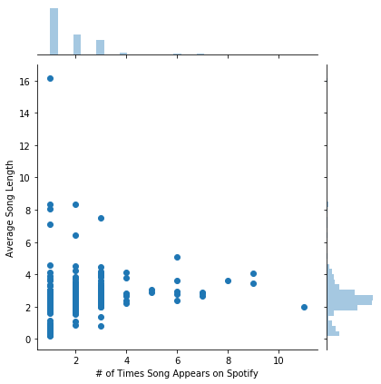
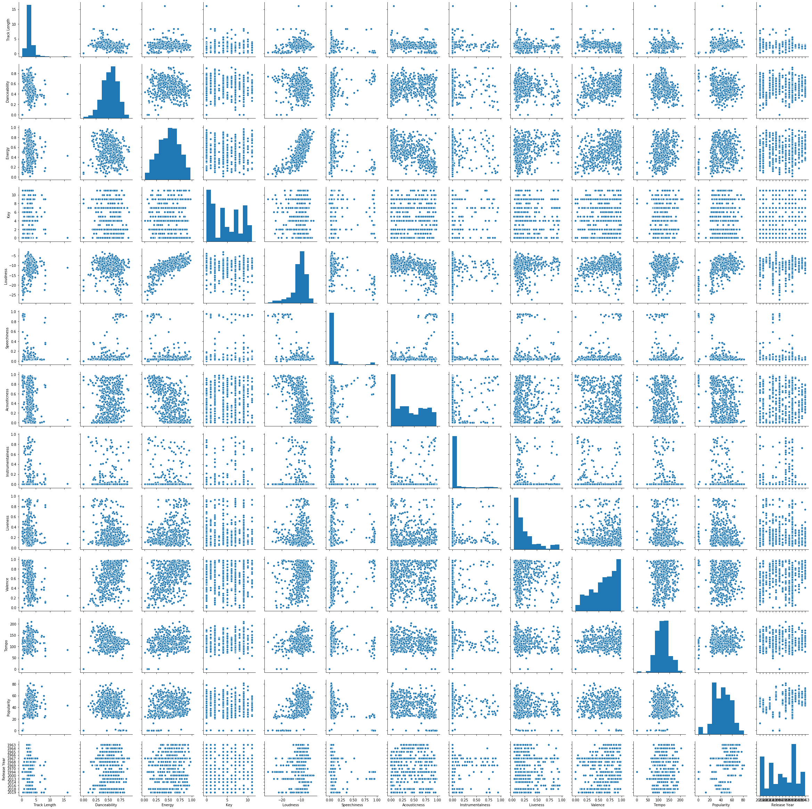
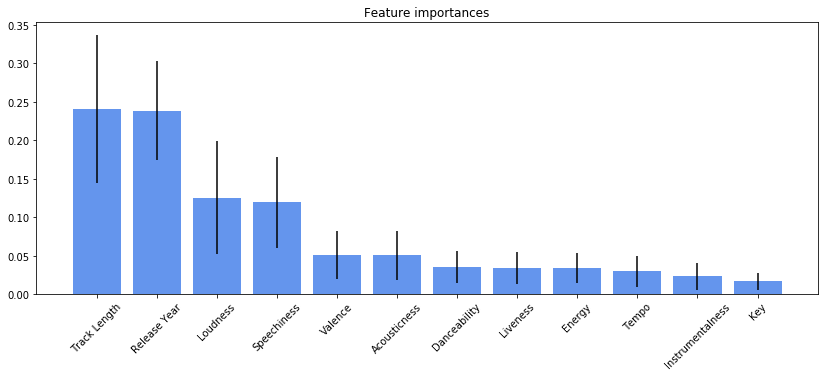

```python
my_client_id = 'b731995fc93042c680a78197273207e4'
my_client_secret='f8954ebd207e41eba7e0a22fe7f2eff4'
```


```python
import pandas as pd
import numpy as np

import spotipy
from spotipy.oauth2 import SpotifyClientCredentials
import spotipy.util as util

username = 'drogers771'
scope=''

ccm = SpotifyClientCredentials(client_id=my_client_id,
                               client_secret=my_client_secret)

my_token = util.prompt_for_user_token(username,
                           scope,
                           client_id='b731995fc93042c680a78197273207e4',
                           client_secret='f8954ebd207e41eba7e0a22fe7f2eff4',
                           redirect_uri='http://localhost:8889')
```


```python
# Let's pick a popular artist
artist = get_artist('The Beatles')
```


```python
# Grab all the albums for our artist above
from spotipy.oauth2 import SpotifyClientCredentials
import sys
import spotipy

sp = spotipy.Spotify(client_credentials_manager=ccm)

def get_artist(name):
    results = sp.search(q='artist:' + name, type='artist',market='US')
    items = results['artists']['items']
    return items[0]


albums = []
results = sp.artist_albums(artist['id'], album_type='album')
albums.extend(results['items'])
while results['next']:
    results = sp.next(results)
    albums.extend(results['items'])
    
unique = []
album_id = []


for album in albums:
    name = album['name'].lower()
    id_name = album['id']
    if name not in unique:
        unique.append(name)
        album_id.append(id_name)
 
print('Total albums on Spotify:', len(unique))

```

    Total albums on Spotify: 23
    


```python
# Grab all the songs on each of their albums
tracks = []
ids = []
Artist=[]
Album=[]
Track=[]
Track_Length=[]

for i in album_id:
    results = sp.album_tracks(album_id=i)
    tracks.extend(results['items'])
while results['next']:
    results = sp.next(results)
    tracks.extend(results['items'])
for track in tracks:
    ids.append(track['id'])
    Track.append(track['name'])
    Artist.append(track['artists'][0]['name'])
    Track_Length.append(track['duration_ms']/60000)   
    
df_tracks = pd.DataFrame({'Artist':Artist,
                        'Track':Track,
                        'Track Length':Track_Length,
                        'Track ID':ids})
print(df_tracks.shape)
```

    (534, 4)
    


```python
# Go back and grab some features such as when the album was released and tracks' popularity
temp=[]
Artist=[]
Album_ID=[]
Album=[]
Album_Release=[]
Track=[]
Track_ID=[]
Popularity=[]

for row in df_tracks['Track ID']:
    results = sp.track(track_id=row)
    temp.append(results)
for i in temp:
    Artist.append(i['artists'][0]['name'])
    Album.append(i['album']['name'])
    Album_ID.append(i['album']['id'])
    Album_Release.append(i['album']['release_date'])
    Track.append(i['name'])
    Track_ID.append(i['id'])
    Popularity.append(i['popularity'])
df_albums = pd.DataFrame({'Artist':Artist,
                          'Album':Album,
                          'Album ID':Album_ID,
                          'Album Release':Album_Release,
                           #'Track':Track,
                          'Track ID':Track_ID,
                          'Popularity':Popularity})
print(df_albums.shape)
```

    retrying ...1secs
    retrying ...1secs
    retrying ...1secs
    (534, 6)
    


```python
# Grab features of each song like Energy, Loudness, etc.
audio = []
Danceability = []
Energy = []
Key = []
Loudness = []
Speechiness = []
Acousticness = []
Instrumentalness = []
Liveness = []
Valence = []
Tempo = []
track_id = []

for i in ids:
    results = sp.audio_features(i)
    audio.extend(results) 
for i,j in enumerate(audio):
    track_id.append(j['id'])
    Danceability.append(j['danceability'])
    Energy.append(j['energy'])
    Key.append(j['key'])
    Loudness.append(j['loudness'])
    Speechiness.append(j['speechiness'])
    Acousticness.append(j['acousticness'])
    Instrumentalness.append(j['instrumentalness'])
    Liveness.append(j['liveness'])
    Valence.append(j['valence'])
    Tempo.append(j['tempo'])
    
df_audio = pd.DataFrame({'Track ID': track_id,
                        'Danceability':Danceability,
                        'Energy':Energy,
                        'Key':Key,
                        'Loudness':Loudness,
                        'Speechiness':Speechiness,
                        'Acousticness':Acousticness,
                        'Instrumentalness':Instrumentalness,
                        'Liveness':Liveness,
                        'Valence':Valence,
                        'Tempo':Tempo})
print(df_audio.shape)
```

    retrying ...2secs
    retrying ...1secs
    retrying ...2secs
    (534, 11)
    


```python
# Merge the previous two dataframes
df = df_tracks.merge(df_audio,on='Track ID')
df = df.merge(df_albums, on='Track ID')
```


```python
df.head()
```


<div>
<style scoped>
    .dataframe tbody tr th:only-of-type {
        vertical-align: middle;
    }

    .dataframe tbody tr th {
        vertical-align: top;
    }

    .dataframe thead th {
        text-align: right;
    }
</style>
<table border="1" class="dataframe">
  <thead>
    <tr style="text-align: right;">
      <th></th>
      <th>Artist_x</th>
      <th>Track</th>
      <th>Track Length</th>
      <th>Track ID</th>
      <th>Danceability</th>
      <th>Energy</th>
      <th>Key</th>
      <th>Loudness</th>
      <th>Speechiness</th>
      <th>Acousticness</th>
      <th>Instrumentalness</th>
      <th>Liveness</th>
      <th>Valence</th>
      <th>Tempo</th>
      <th>Artist_y</th>
      <th>Album</th>
      <th>Album ID</th>
      <th>Album Release</th>
      <th>Popularity</th>
    </tr>
  </thead>
  <tbody>
    <tr>
      <td>0</td>
      <td>The Beatles</td>
      <td>Come Together - 2019 Mix</td>
      <td>4.336667</td>
      <td>6lSxM9BKcEZBSDKl2VODsF</td>
      <td>0.536</td>
      <td>0.360</td>
      <td>9</td>
      <td>-10.973</td>
      <td>0.0408</td>
      <td>0.0823</td>
      <td>0.167000</td>
      <td>0.0996</td>
      <td>0.147</td>
      <td>164.891</td>
      <td>The Beatles</td>
      <td>Abbey Road (Super Deluxe Edition)</td>
      <td>5iT3F2EhjVQVrO4PKhsP8c</td>
      <td>2019-09-27</td>
      <td>57</td>
    </tr>
    <tr>
      <td>1</td>
      <td>The Beatles</td>
      <td>Something - 2019 Mix</td>
      <td>3.037100</td>
      <td>3S6N0Wbem9KV3DBcYNfXuv</td>
      <td>0.416</td>
      <td>0.385</td>
      <td>0</td>
      <td>-9.388</td>
      <td>0.0279</td>
      <td>0.0958</td>
      <td>0.000005</td>
      <td>0.2280</td>
      <td>0.458</td>
      <td>133.298</td>
      <td>The Beatles</td>
      <td>Abbey Road (Super Deluxe Edition)</td>
      <td>5iT3F2EhjVQVrO4PKhsP8c</td>
      <td>2019-09-27</td>
      <td>56</td>
    </tr>
    <tr>
      <td>2</td>
      <td>The Beatles</td>
      <td>Maxwell's Silver Hammer - 2019 Mix</td>
      <td>3.466217</td>
      <td>0fnY9xlLJCgtBUBX9rNzDJ</td>
      <td>0.816</td>
      <td>0.386</td>
      <td>2</td>
      <td>-9.443</td>
      <td>0.0382</td>
      <td>0.4970</td>
      <td>0.000093</td>
      <td>0.3090</td>
      <td>0.708</td>
      <td>131.099</td>
      <td>The Beatles</td>
      <td>Abbey Road (Super Deluxe Edition)</td>
      <td>5iT3F2EhjVQVrO4PKhsP8c</td>
      <td>2019-09-27</td>
      <td>54</td>
    </tr>
    <tr>
      <td>3</td>
      <td>The Beatles</td>
      <td>Oh! Darling - 2019 Mix</td>
      <td>3.452433</td>
      <td>3UHv8SSIkNUDRBUHJx3Cg6</td>
      <td>0.437</td>
      <td>0.669</td>
      <td>4</td>
      <td>-6.524</td>
      <td>0.0395</td>
      <td>0.0344</td>
      <td>0.003950</td>
      <td>0.3470</td>
      <td>0.514</td>
      <td>173.670</td>
      <td>The Beatles</td>
      <td>Abbey Road (Super Deluxe Edition)</td>
      <td>5iT3F2EhjVQVrO4PKhsP8c</td>
      <td>2019-09-27</td>
      <td>55</td>
    </tr>
    <tr>
      <td>4</td>
      <td>The Beatles</td>
      <td>Octopus's Garden - 2019 Mix</td>
      <td>2.846667</td>
      <td>3e1w0Wm0sH8nUYPArDkBG3</td>
      <td>0.565</td>
      <td>0.645</td>
      <td>1</td>
      <td>-6.194</td>
      <td>0.0332</td>
      <td>0.1130</td>
      <td>0.000625</td>
      <td>0.1240</td>
      <td>0.626</td>
      <td>92.253</td>
      <td>The Beatles</td>
      <td>Abbey Road (Super Deluxe Edition)</td>
      <td>5iT3F2EhjVQVrO4PKhsP8c</td>
      <td>2019-09-27</td>
      <td>53</td>
    </tr>
  </tbody>
</table>
</div>


```python
# Create new feature for year the album was released.
df['Release Year'] = df['Album Release'].str.split('-').str[0]
```


```python
# Attempting to get all trackname to be written the same way. Some have (Live) or '- Live'. Additionally, some tracks were just
# entering incorrectly in Spotify.
df['Track_New'] = df['Track'].str.replace(' \[| \(', '-').str.split('-',expand = True)[0].str.rstrip().str.lower()
df.groupby('Track_New').mean()['Track Length']

pd.set_option('display.max_rows', df.shape[0]+1)
df['Track_New'].value_counts()

df['Track_New'].describe()

```


    count                                       534
    unique                                      275
    top       sgt. pepper's lonely hearts club band
    freq                                         11
    Name: Track_New, dtype: object


```python
import seaborn as sns
import matplotlib.pyplot as plt
%matplotlib inline 
```


```python
plt.figure(figsize=(10,6))
fig1 = sns.jointplot(data=summary_df[summary_df['Number_of_Times_on_Spotify']>=1],
                     x='Number_of_Times_on_Spotify',
                     y='Mean_Track_Length')

fig1.ax_joint.set_xlabel('# of Times Song Appears on Spotify')
fig1.ax_joint.set_ylabel('Average Song Length')

```


    Text(27.125, 0.5, 'Average Song Length')


    <Figure size 720x432 with 0 Axes>





```python
from plotly import __version__
from plotly.offline import download_plotlyjs, init_notebook_mode, plot, iplot 
import cufflinks as cf

# Set notebook mode to work in offline
pyo.init_notebook_mode()
# For offline use
cf.go_offline()
```


    ---------------------------------------------------------------------------

    NameError                                 Traceback (most recent call last)

    <ipython-input-275-05753da37cbd> in <module>
          4 
          5 # Set notebook mode to work in offline
    ----> 6 pyo.init_notebook_mode()
          7 # For offline use
          8 cf.go_offline()
    

    NameError: name 'pyo' is not defined


```python
import plotly.express as px
fig = px.box(df, x='Release Year', y='Track Length')
fig.show()
```


<div>


            <div id="af7b4f89-aea7-4997-9187-87570f941e8a" class="plotly-graph-div" style="height:525px; width:100%;"></div>
            <script type="text/javascript">
                require(["plotly"], function(Plotly) {
                    window.PLOTLYENV=window.PLOTLYENV || {};

                if (document.getElementById("af7b4f89-aea7-4997-9187-87570f941e8a")) {
                    Plotly.newPlot(
                        'af7b4f89-aea7-4997-9187-87570f941e8a',
                        [{"alignmentgroup": "True", "hoverlabel": {"namelength": 0}, "hovertemplate": "Release Year=%{x}<br>Track Length=%{y}", "legendgroup": "", "marker": {"color": "#636efa"}, "name": "", "notched": false, "offsetgroup": "", "orientation": "v", "showlegend": false, "type": "box", "x": ["2019", "2019", "2019", "2019", "2019", "2019", "2019", "2019", "2019", "2019", "2019", "2019", "2019", "2019", "2019", "2019", "2019", "2019", "2019", "2019", "2019", "2019", "2019", "2019", "2019", "2019", "2019", "2019", "2019", "2019", "2019", "2019", "2019", "2019", "2019", "2019", "2019", "2019", "2019", "2019", "2018", "2018", "2018", "2018", "2018", "2018", "2018", "2018", "2018", "2018", "2018", "2018", "2018", "2018", "2018", "2018", "2018", "2018", "2018", "2018", "2018", "2018", "2018", "2018", "2018", "2018", "2018", "2018", "2018", "2018", "2018", "2018", "2018", "2018", "2018", "2018", "2018", "2018", "2018", "2018", "2018", "2018", "2018", "2018", "2018", "2018", "2018", "2018", "2018", "2018", "2016", "2016", "2016", "2016", "2016", "2016", "2016", "2016", "2016", "2016", "2016", "2016", "2016", "2016", "2016", "2016", "2016", "2014", "2014", "2014", "2014", "2014", "2014", "2014", "2014", "2014", "2014", "2014", "2014", "2014", "2014", "2014", "2014", "2014", "2014", "2014", "2014", "2014", "2014", "2014", "2014", "2014", "2014", "2013", "2013", "2013", "2013", "2013", "2013", "2013", "2013", "2013", "2013", "2013", "2013", "2013", "2013", "2013", "2013", "2013", "2013", "2013", "2013", "2013", "2013", "2013", "2013", "2013", "2013", "2013", "2013", "2013", "2013", "2013", "2013", "2013", "2013", "2013", "2013", "2013", "2013", "2013", "2013", "2013", "2013", "2013", "2013", "2013", "2013", "2013", "2013", "2013", "2013", "2000", "2000", "2000", "2000", "2000", "2000", "2000", "2000", "2000", "2000", "2000", "2000", "2000", "2000", "2000", "2000", "2000", "2000", "2000", "2000", "2000", "2000", "2000", "2000", "2000", "2000", "2000", "1994", "1994", "1994", "1994", "1994", "1994", "1994", "1994", "1994", "1994", "1994", "1994", "1994", "1994", "1994", "1994", "1994", "1994", "1994", "1994", "1994", "1994", "1994", "1994", "1994", "1994", "1994", "1994", "1994", "1994", "1994", "1994", "1994", "1994", "1994", "1994", "1994", "1994", "1994", "1994", "1994", "1994", "1994", "1994", "1994", "1994", "1994", "1994", "1994", "1994", "1970", "1970", "1970", "1970", "1970", "1970", "1970", "1970", "1970", "1970", "1970", "1970", "1969", "1969", "1969", "1969", "1969", "1969", "1969", "1969", "1969", "1969", "1969", "1969", "1969", "1969", "1969", "1969", "1969", "1969", "1969", "1969", "1969", "1969", "1969", "1969", "1969", "1969", "1969", "1969", "1969", "1969", "1968", "1968", "1968", "1968", "1968", "1968", "1968", "1968", "1968", "1968", "1968", "1968", "1968", "1968", "1968", "1968", "1968", "1968", "1968", "1968", "1968", "1968", "1968", "1968", "1968", "1968", "1968", "1968", "1968", "1968", "1967", "1967", "1967", "1967", "1967", "1967", "1967", "1967", "1967", "1967", "1967", "1967", "1967", "1967", "1967", "1967", "1967", "1967", "1967", "1967", "1967", "1967", "1967", "1967", "1967", "1967", "1967", "1967", "1967", "1967", "1967", "1967", "1967", "1967", "1967", "1967", "1967", "1967", "1967", "1967", "1967", "1967", "1967", "1967", "1967", "1967", "1967", "1967", "1967", "1967", "1967", "1967", "1967", "1967", "1967", "1967", "1967", "1967", "1967", "1967", "1967", "1967", "1967", "1967", "1967", "1967", "1967", "1967", "1967", "1967", "1967", "1967", "1967", "1967", "1967", "1967", "1967", "1967", "1967", "1967", "1967", "1967", "1967", "1967", "1967", "1967", "1967", "1967", "1967", "1967", "1967", "1967", "1967", "1967", "1967", "1967", "1967", "1967", "1967", "1967", "1967", "1967", "1967", "1967", "1967", "1966", "1966", "1966", "1966", "1966", "1966", "1966", "1966", "1966", "1966", "1966", "1966", "1966", "1966", "1965", "1965", "1965", "1965", "1965", "1965", "1965", "1965", "1965", "1965", "1965", "1965", "1965", "1965", "1965", "1965", "1965", "1965", "1965", "1965", "1965", "1965", "1965", "1965", "1965", "1965", "1965", "1965", "1964", "1964", "1964", "1964", "1964", "1964", "1964", "1964", "1964", "1964", "1964", "1964", "1964", "1964", "1964", "1964", "1964", "1964", "1964", "1964", "1964", "1964", "1964", "1964", "1964", "1964", "1964", "1963", "1963", "1963", "1963", "1963", "1963", "1963", "1963", "1963", "1963", "1963", "1963", "1963", "1963", "1963", "1963", "1963", "1963", "1963", "1963", "1963", "1963", "1963", "1963", "1963", "1963", "1963", "1963"], "x0": " ", "xaxis": "x", "y": [4.336666666666667, 3.0371, 3.4662166666666665, 3.4524333333333335, 2.8466666666666667, 7.789333333333333, 3.0951, 2.7602166666666665, 4.044433333333333, 2.4388833333333335, 1.1077666666666666, 1.2133333333333334, 1.9802166666666667, 1.524, 1.6073333333333333, 2.3651, 0.4186666666666667, 6.993333333333333, 2.3951, 3.620433333333333, 3.62755, 3.2637666666666667, 3.512, 1.7166666666666666, 5.298, 1.5657666666666668, 3.3417666666666666, 3.6828833333333333, 4.740666666666667, 3.5024333333333333, 2.1846666666666668, 2.712666666666667, 3.2337666666666665, 1.57155, 1.6526666666666667, 2.1013333333333333, 3.1253333333333333, 16.174433333333333, 2.695333333333333, 3.2877666666666667, 2.7244333333333333, 3.9162166666666667, 2.2951, 3.1468833333333333, 0.8833333333333333, 3.2364333333333333, 4.754666666666667, 2.742, 2.474666666666667, 2.0566666666666666, 2.306, 2.0717666666666665, 3.5513333333333335, 3.838433333333333, 1.69555, 1.7631, 2.93555, 2.6997666666666666, 4.016666666666667, 2.7971, 2.4108833333333335, 3.2571, 4.496216666666666, 3.1071, 4.260883333333333, 2.686, 2.9073333333333333, 3.0311, 8.34755, 3.25355, 2.9984333333333333, 4.784216666666667, 1.9266666666666667, 3.1766666666666667, 2.682, 2.6906666666666665, 1.9171, 3.179333333333333, 2.5753333333333335, 2.096433333333333, 2.7386666666666666, 3.9411, 3.5231, 2.4068833333333335, 3.0648833333333334, 2.4448833333333333, 4.110666666666667, 1.9984333333333333, 2.4622166666666665, 3.72555, 1.5584333333333333, 3.2008833333333335, 3.6622166666666667, 2.437333333333333, 2.2477666666666667, 2.3122166666666666, 2.23355, 2.145766666666667, 3.2293333333333334, 2.8766666666666665, 2.2542166666666668, 3.183333333333333, 2.07755, 2.5737666666666668, 2.4877666666666665, 2.3571, 2.7442166666666665, 2.5808, 3.635466666666667, 2.4634666666666667, 3.5730333333333335, 3.34725, 3.5150333333333332, 2.7350333333333334, 3.3143666666666665, 2.3577, 3.637033333333333, 3.923033333333333, 2.6526666666666667, 3.1973333333333334, 2.0871, 2.9784333333333333, 2.1771, 3.473333333333333, 2.3106666666666666, 2.022666666666667, 2.7611, 3.01, 3.4084333333333334, 3.7777666666666665, 2.65155, 2.7066666666666666, 6.426666666666667, 0.2571333333333333, 1.9291, 0.6211, 1.792, 2.48, 0.3511, 2.826, 0.31466666666666665, 1.924, 1.8262166666666666, 1.8688833333333332, 0.612, 2.47955, 0.45643333333333336, 2.2517, 1.9038333333333333, 2.26955, 1.7808833333333334, 0.38843333333333335, 1.7688833333333334, 2.3642166666666666, 1.816, 0.822, 1.9888833333333333, 2.2748833333333334, 1.7684333333333333, 2.3611, 0.2771, 2.3442166666666666, 0.5713333333333334, 2.422, 0.4011, 8.364666666666666, 8.077666666666667, 2.59555, 1.8748833333333332, 0.6166666666666667, 2.0391, 2.254, 2.264883333333333, 0.5642166666666667, 0.4073333333333333, 1.8464333333333334, 2.71355, 2.3888833333333332, 0.9753333333333334, 2.2666666666666666, 0.7433333333333333, 2.594, 1.9717666666666667, 2.3362166666666666, 1.936, 2.3486666666666665, 2.4291, 2.1868833333333333, 2.5486666666666666, 2.322433333333333, 2.722, 3.1686666666666667, 2.320666666666667, 2.0886666666666667, 2.816666666666667, 2.26155, 2.3033333333333332, 2.6466666666666665, 2.097766666666667, 3.0086666666666666, 3.796, 3.4631, 2.2804333333333333, 7.094216666666667, 3.1962166666666665, 2.9913333333333334, 3.02355, 4.31155, 3.8406666666666665, 3.6573333333333333, 0.22955, 0.4931, 0.9148833333333334, 2.80555, 2.1262166666666666, 2.521333333333333, 1.96355, 1.9257666666666666, 2.2666666666666666, 2.1348833333333332, 2.01955, 2.07755, 0.4693333333333333, 2.7257666666666664, 2.9273333333333333, 2.6037666666666666, 0.5191, 1.9853333333333334, 0.4282166666666667, 2.665766666666667, 2.033333333333333, 2.1862166666666667, 0.7108833333333333, 2.6371, 2.848883333333333, 1.9782166666666667, 1.89955, 2.58555, 1.6662166666666667, 2.854216666666667, 2.2631, 1.836, 2.12755, 0.46776666666666666, 2.2904333333333335, 1.1568833333333333, 2.7266666666666666, 0.23088333333333333, 2.1646666666666667, 0.336, 2.2791, 2.1117666666666666, 2.2973333333333334, 3.314433333333333, 2.3577666666666666, 0.17266666666666666, 2.6026666666666665, 2.998, 1.8384333333333334, 1.8802166666666666, 3.61355, 3.9166666666666665, 3.802216666666667, 2.426433333333333, 0.8411, 4.050433333333333, 0.6673333333333333, 3.626, 2.8993333333333333, 3.636433333333333, 2.5368833333333334, 3.156433333333333, 4.332433333333333, 3.0382166666666666, 3.465333333333333, 3.454, 2.8453333333333335, 7.788666666666667, 3.09555, 2.7611, 4.04955, 2.4377666666666666, 1.1088833333333334, 1.2106666666666666, 1.9771, 1.5293333333333334, 1.6077666666666666, 2.3602166666666666, 0.4331, 2.662, 3.4082166666666667, 2.18155, 3.1884333333333332, 6.416883333333334, 3.85355, 2.34555, 3.00355, 2.278216666666667, 3.61155, 2.3226666666666667, 2.2128833333333335, 2.2337666666666665, 2.7242166666666665, 3.92955, 2.2973333333333334, 3.1493333333333333, 0.8828833333333334, 3.236, 4.75, 2.7424333333333335, 2.4762166666666667, 2.0582166666666666, 2.306433333333333, 2.0711, 3.5517666666666665, 3.840883333333333, 1.686, 1.76555, 2.9444333333333335, 2.718, 4.00755, 2.8004333333333333, 2.4128833333333333, 3.2544333333333335, 4.496433333333333, 3.1051, 4.2617666666666665, 2.686, 2.907766666666667, 3.034666666666667, 8.366883333333334, 3.2293333333333334, 2.8351, 2.9851, 2.2586666666666666, 3.9177666666666666, 2.47355, 4.597766666666667, 3.4806666666666666, 4.122, 3.014883333333333, 3.0217666666666667, 3.8397666666666668, 2.03555, 2.7548833333333334, 3.461333333333333, 2.78355, 2.6326666666666667, 3.4306666666666668, 2.6533333333333333, 5.126433333333333, 2.6668833333333333, 2.763333333333333, 2.5744333333333334, 1.3433333333333333, 5.515333333333333, 2.6073333333333335, 3.275333333333333, 3.9811, 2.308883333333333, 3.464, 3.8186666666666667, 3.120216666666667, 5.556666666666667, 2.97755, 3.0726666666666667, 2.7773333333333334, 1.9344333333333332, 4.866, 3.2813333333333334, 3.330216666666667, 4.106883333333333, 2.9451, 2.9857666666666667, 2.048216666666667, 2.7351, 3.4744333333333333, 2.802, 2.613766666666667, 3.586, 2.62555, 5.077766666666666, 2.6277666666666666, 2.70155, 2.6871, 1.3177666666666668, 5.62355, 2.03555, 2.7548833333333334, 3.461333333333333, 2.78355, 2.6326666666666667, 3.4306666666666668, 2.6533333333333333, 5.126433333333333, 2.6668833333333333, 2.763333333333333, 2.5744333333333334, 1.3433333333333333, 5.5151, 2.6631, 3.002, 3.2791, 3.314216666666667, 4.165333333333334, 3.0193333333333334, 2.9257666666666666, 1.7848833333333334, 3.01155, 4.69155, 4.818666666666667, 0.9297666666666666, 1.9093333333333333, 2.8848833333333332, 2.5686666666666667, 2.612, 1.0737666666666668, 2.7884333333333333, 2.989333333333333, 3.47, 3.1386666666666665, 2.5866666666666664, 3.08355, 3.672, 4.141333333333334, 2.32, 2.7508833333333333, 5.542666666666666, 3.927766666666667, 3.8191, 3.8042166666666666, 3.24955, 1.986, 2.03955, 2.752666666666667, 3.45555, 2.78755, 2.64755, 2.1088833333333334, 3.005333333333333, 2.9971, 2.4146666666666667, 2.648, 2.6006666666666667, 2.1548833333333333, 2.0082166666666668, 1.9968833333333333, 2.2377666666666665, 2.4662166666666665, 2.4873333333333334, 2.9924333333333335, 2.48155, 2.0782166666666666, 3.332666666666667, 2.7282166666666665, 2.308666666666667, 2.7184333333333335, 2.7062166666666667, 2.80955, 2.5286666666666666, 2.439766666666667, 2.4388833333333335, 2.2453333333333334, 2.3711, 2.35155, 2.326, 2.5822166666666666, 2.152, 2.4797666666666665, 2.0893333333333333, 2.3111, 3.1613333333333333, 2.5062166666666665, 1.9413333333333334, 2.6144333333333334, 2.6331, 2.084, 2.0944333333333334, 2.9417666666666666, 2.2677666666666667, 2.5004333333333335, 2.0753333333333335, 2.521333333333333, 1.8142166666666666, 2.6437666666666666, 2.6357666666666666, 2.7266666666666666, 2.072, 2.9571, 2.0633333333333335, 2.5744333333333334, 2.5006666666666666, 2.433333333333333, 2.57, 2.718, 2.3244333333333334, 1.93955, 2.494883333333333, 2.1448833333333335, 2.197766666666667, 2.188, 1.7664333333333333, 2.5888833333333334, 2.2773333333333334, 2.58155, 2.4031, 2.2231, 2.042883333333333, 2.1308833333333332, 2.4708833333333335, 1.7733333333333334, 2.2251, 2.5693333333333332, 2.7577666666666665, 2.5317666666666665, 3.0224333333333333, 1.9917666666666667, 2.4368833333333333, 2.113766666666667, 2.8251, 2.8991, 1.8091, 2.9522166666666667, 2.418, 2.4406666666666665, 2.4422166666666665, 2.0142166666666665, 2.36155, 2.0726666666666667, 2.675333333333333, 1.9502166666666667, 2.058, 1.84155, 2.5871], "y0": " ", "yaxis": "y"}],
                        {"boxmode": "group", "legend": {"tracegroupgap": 0}, "margin": {"t": 60}, "template": {"data": {"bar": [{"error_x": {"color": "#2a3f5f"}, "error_y": {"color": "#2a3f5f"}, "marker": {"line": {"color": "#E5ECF6", "width": 0.5}}, "type": "bar"}], "barpolar": [{"marker": {"line": {"color": "#E5ECF6", "width": 0.5}}, "type": "barpolar"}], "carpet": [{"aaxis": {"endlinecolor": "#2a3f5f", "gridcolor": "white", "linecolor": "white", "minorgridcolor": "white", "startlinecolor": "#2a3f5f"}, "baxis": {"endlinecolor": "#2a3f5f", "gridcolor": "white", "linecolor": "white", "minorgridcolor": "white", "startlinecolor": "#2a3f5f"}, "type": "carpet"}], "choropleth": [{"colorbar": {"outlinewidth": 0, "ticks": ""}, "type": "choropleth"}], "contour": [{"colorbar": {"outlinewidth": 0, "ticks": ""}, "colorscale": [[0.0, "#0d0887"], [0.1111111111111111, "#46039f"], [0.2222222222222222, "#7201a8"], [0.3333333333333333, "#9c179e"], [0.4444444444444444, "#bd3786"], [0.5555555555555556, "#d8576b"], [0.6666666666666666, "#ed7953"], [0.7777777777777778, "#fb9f3a"], [0.8888888888888888, "#fdca26"], [1.0, "#f0f921"]], "type": "contour"}], "contourcarpet": [{"colorbar": {"outlinewidth": 0, "ticks": ""}, "type": "contourcarpet"}], "heatmap": [{"colorbar": {"outlinewidth": 0, "ticks": ""}, "colorscale": [[0.0, "#0d0887"], [0.1111111111111111, "#46039f"], [0.2222222222222222, "#7201a8"], [0.3333333333333333, "#9c179e"], [0.4444444444444444, "#bd3786"], [0.5555555555555556, "#d8576b"], [0.6666666666666666, "#ed7953"], [0.7777777777777778, "#fb9f3a"], [0.8888888888888888, "#fdca26"], [1.0, "#f0f921"]], "type": "heatmap"}], "heatmapgl": [{"colorbar": {"outlinewidth": 0, "ticks": ""}, "colorscale": [[0.0, "#0d0887"], [0.1111111111111111, "#46039f"], [0.2222222222222222, "#7201a8"], [0.3333333333333333, "#9c179e"], [0.4444444444444444, "#bd3786"], [0.5555555555555556, "#d8576b"], [0.6666666666666666, "#ed7953"], [0.7777777777777778, "#fb9f3a"], [0.8888888888888888, "#fdca26"], [1.0, "#f0f921"]], "type": "heatmapgl"}], "histogram": [{"marker": {"colorbar": {"outlinewidth": 0, "ticks": ""}}, "type": "histogram"}], "histogram2d": [{"colorbar": {"outlinewidth": 0, "ticks": ""}, "colorscale": [[0.0, "#0d0887"], [0.1111111111111111, "#46039f"], [0.2222222222222222, "#7201a8"], [0.3333333333333333, "#9c179e"], [0.4444444444444444, "#bd3786"], [0.5555555555555556, "#d8576b"], [0.6666666666666666, "#ed7953"], [0.7777777777777778, "#fb9f3a"], [0.8888888888888888, "#fdca26"], [1.0, "#f0f921"]], "type": "histogram2d"}], "histogram2dcontour": [{"colorbar": {"outlinewidth": 0, "ticks": ""}, "colorscale": [[0.0, "#0d0887"], [0.1111111111111111, "#46039f"], [0.2222222222222222, "#7201a8"], [0.3333333333333333, "#9c179e"], [0.4444444444444444, "#bd3786"], [0.5555555555555556, "#d8576b"], [0.6666666666666666, "#ed7953"], [0.7777777777777778, "#fb9f3a"], [0.8888888888888888, "#fdca26"], [1.0, "#f0f921"]], "type": "histogram2dcontour"}], "mesh3d": [{"colorbar": {"outlinewidth": 0, "ticks": ""}, "type": "mesh3d"}], "parcoords": [{"line": {"colorbar": {"outlinewidth": 0, "ticks": ""}}, "type": "parcoords"}], "pie": [{"automargin": true, "type": "pie"}], "scatter": [{"marker": {"colorbar": {"outlinewidth": 0, "ticks": ""}}, "type": "scatter"}], "scatter3d": [{"line": {"colorbar": {"outlinewidth": 0, "ticks": ""}}, "marker": {"colorbar": {"outlinewidth": 0, "ticks": ""}}, "type": "scatter3d"}], "scattercarpet": [{"marker": {"colorbar": {"outlinewidth": 0, "ticks": ""}}, "type": "scattercarpet"}], "scattergeo": [{"marker": {"colorbar": {"outlinewidth": 0, "ticks": ""}}, "type": "scattergeo"}], "scattergl": [{"marker": {"colorbar": {"outlinewidth": 0, "ticks": ""}}, "type": "scattergl"}], "scattermapbox": [{"marker": {"colorbar": {"outlinewidth": 0, "ticks": ""}}, "type": "scattermapbox"}], "scatterpolar": [{"marker": {"colorbar": {"outlinewidth": 0, "ticks": ""}}, "type": "scatterpolar"}], "scatterpolargl": [{"marker": {"colorbar": {"outlinewidth": 0, "ticks": ""}}, "type": "scatterpolargl"}], "scatterternary": [{"marker": {"colorbar": {"outlinewidth": 0, "ticks": ""}}, "type": "scatterternary"}], "surface": [{"colorbar": {"outlinewidth": 0, "ticks": ""}, "colorscale": [[0.0, "#0d0887"], [0.1111111111111111, "#46039f"], [0.2222222222222222, "#7201a8"], [0.3333333333333333, "#9c179e"], [0.4444444444444444, "#bd3786"], [0.5555555555555556, "#d8576b"], [0.6666666666666666, "#ed7953"], [0.7777777777777778, "#fb9f3a"], [0.8888888888888888, "#fdca26"], [1.0, "#f0f921"]], "type": "surface"}], "table": [{"cells": {"fill": {"color": "#EBF0F8"}, "line": {"color": "white"}}, "header": {"fill": {"color": "#C8D4E3"}, "line": {"color": "white"}}, "type": "table"}]}, "layout": {"annotationdefaults": {"arrowcolor": "#2a3f5f", "arrowhead": 0, "arrowwidth": 1}, "coloraxis": {"colorbar": {"outlinewidth": 0, "ticks": ""}}, "colorscale": {"diverging": [[0, "#8e0152"], [0.1, "#c51b7d"], [0.2, "#de77ae"], [0.3, "#f1b6da"], [0.4, "#fde0ef"], [0.5, "#f7f7f7"], [0.6, "#e6f5d0"], [0.7, "#b8e186"], [0.8, "#7fbc41"], [0.9, "#4d9221"], [1, "#276419"]], "sequential": [[0.0, "#0d0887"], [0.1111111111111111, "#46039f"], [0.2222222222222222, "#7201a8"], [0.3333333333333333, "#9c179e"], [0.4444444444444444, "#bd3786"], [0.5555555555555556, "#d8576b"], [0.6666666666666666, "#ed7953"], [0.7777777777777778, "#fb9f3a"], [0.8888888888888888, "#fdca26"], [1.0, "#f0f921"]], "sequentialminus": [[0.0, "#0d0887"], [0.1111111111111111, "#46039f"], [0.2222222222222222, "#7201a8"], [0.3333333333333333, "#9c179e"], [0.4444444444444444, "#bd3786"], [0.5555555555555556, "#d8576b"], [0.6666666666666666, "#ed7953"], [0.7777777777777778, "#fb9f3a"], [0.8888888888888888, "#fdca26"], [1.0, "#f0f921"]]}, "colorway": ["#636efa", "#EF553B", "#00cc96", "#ab63fa", "#FFA15A", "#19d3f3", "#FF6692", "#B6E880", "#FF97FF", "#FECB52"], "font": {"color": "#2a3f5f"}, "geo": {"bgcolor": "white", "lakecolor": "white", "landcolor": "#E5ECF6", "showlakes": true, "showland": true, "subunitcolor": "white"}, "hoverlabel": {"align": "left"}, "hovermode": "closest", "mapbox": {"style": "light"}, "paper_bgcolor": "white", "plot_bgcolor": "#E5ECF6", "polar": {"angularaxis": {"gridcolor": "white", "linecolor": "white", "ticks": ""}, "bgcolor": "#E5ECF6", "radialaxis": {"gridcolor": "white", "linecolor": "white", "ticks": ""}}, "scene": {"xaxis": {"backgroundcolor": "#E5ECF6", "gridcolor": "white", "gridwidth": 2, "linecolor": "white", "showbackground": true, "ticks": "", "zerolinecolor": "white"}, "yaxis": {"backgroundcolor": "#E5ECF6", "gridcolor": "white", "gridwidth": 2, "linecolor": "white", "showbackground": true, "ticks": "", "zerolinecolor": "white"}, "zaxis": {"backgroundcolor": "#E5ECF6", "gridcolor": "white", "gridwidth": 2, "linecolor": "white", "showbackground": true, "ticks": "", "zerolinecolor": "white"}}, "shapedefaults": {"line": {"color": "#2a3f5f"}}, "ternary": {"aaxis": {"gridcolor": "white", "linecolor": "white", "ticks": ""}, "baxis": {"gridcolor": "white", "linecolor": "white", "ticks": ""}, "bgcolor": "#E5ECF6", "caxis": {"gridcolor": "white", "linecolor": "white", "ticks": ""}}, "title": {"x": 0.05}, "xaxis": {"automargin": true, "gridcolor": "white", "linecolor": "white", "ticks": "", "title": {"standoff": 15}, "zerolinecolor": "white", "zerolinewidth": 2}, "yaxis": {"automargin": true, "gridcolor": "white", "linecolor": "white", "ticks": "", "title": {"standoff": 15}, "zerolinecolor": "white", "zerolinewidth": 2}}}, "xaxis": {"anchor": "y", "domain": [0.0, 1.0], "title": {"text": "Release Year"}}, "yaxis": {"anchor": "x", "domain": [0.0, 1.0], "title": {"text": "Track Length"}}},
                        {"responsive": true}
                    ).then(function(){

var gd = document.getElementById('af7b4f89-aea7-4997-9187-87570f941e8a');
var x = new MutationObserver(function (mutations, observer) {{
        var display = window.getComputedStyle(gd).display;
        if (!display || display === 'none') {{
            console.log([gd, 'removed!']);
            Plotly.purge(gd);
            observer.disconnect();
        }}
}});

// Listen for the removal of the full notebook cells
var notebookContainer = gd.closest('#notebook-container');
if (notebookContainer) {{
    x.observe(notebookContainer, {childList: true});
}}

// Listen for the clearing of the current output cell
var outputEl = gd.closest('.output');
if (outputEl) {{
    x.observe(outputEl, {childList: true});
}}

                        })
                };
                });
            </script>
        </div>


```python
fig = px.histogram(df, x='Popularity',nbins=100)
fig.show()
```


<div>


            <div id="91f2635c-c610-4c8c-866d-9d5a0800b741" class="plotly-graph-div" style="height:525px; width:100%;"></div>
            <script type="text/javascript">
                require(["plotly"], function(Plotly) {
                    window.PLOTLYENV=window.PLOTLYENV || {};

                if (document.getElementById("91f2635c-c610-4c8c-866d-9d5a0800b741")) {
                    Plotly.newPlot(
                        '91f2635c-c610-4c8c-866d-9d5a0800b741',
                        [{"alignmentgroup": "True", "bingroup": "x", "hoverlabel": {"namelength": 0}, "hovertemplate": "Popularity=%{x}<br>count=%{y}", "legendgroup": "", "marker": {"color": "#636efa"}, "name": "", "nbinsx": 100, "offsetgroup": "", "orientation": "v", "showlegend": false, "type": "histogram", "x": [57, 56, 54, 55, 53, 53, 55, 51, 52, 50, 50, 50, 50, 51, 51, 50, 13, 48, 48, 47, 47, 45, 45, 45, 44, 44, 44, 46, 43, 44, 42, 43, 42, 41, 41, 42, 41, 43, 42, 41, 51, 48, 43, 54, 40, 41, 52, 45, 43, 43, 52, 40, 43, 40, 41, 45, 42, 41, 40, 40, 39, 40, 45, 39, 40, 39, 38, 39, 37, 36, 38, 37, 32, 37, 34, 38, 34, 35, 37, 33, 34, 34, 33, 33, 32, 33, 35, 33, 33, 33, 40, 34, 34, 36, 36, 32, 33, 37, 38, 36, 35, 35, 33, 31, 36, 30, 31, 43, 40, 39, 44, 42, 41, 38, 46, 40, 43, 44, 57, 45, 53, 39, 44, 47, 39, 42, 42, 39, 37, 45, 43, 42, 39, 0, 31, 27, 31, 29, 0, 31, 0, 30, 28, 28, 26, 27, 1, 27, 28, 30, 26, 0, 27, 27, 26, 25, 27, 29, 27, 27, 0, 25, 24, 32, 0, 25, 23, 28, 24, 23, 26, 27, 25, 25, 0, 26, 26, 28, 23, 28, 22, 23, 24, 57, 58, 66, 74, 56, 58, 63, 56, 55, 58, 60, 63, 61, 62, 55, 58, 57, 57, 55, 61, 76, 55, 57, 55, 54, 59, 53, 0, 2, 28, 30, 29, 29, 30, 28, 28, 28, 31, 28, 1, 30, 28, 27, 26, 32, 0, 27, 27, 28, 25, 28, 31, 27, 26, 27, 27, 31, 26, 25, 27, 1, 27, 24, 26, 0, 25, 0, 26, 29, 26, 25, 26, 0, 26, 25, 26, 24, 53, 49, 66, 51, 45, 78, 46, 52, 47, 62, 47, 64, 78, 70, 58, 67, 61, 60, 81, 58, 58, 55, 54, 54, 56, 63, 61, 56, 21, 49, 42, 45, 51, 42, 43, 39, 36, 34, 33, 33, 33, 35, 65, 61, 53, 70, 49, 51, 69, 57, 54, 55, 73, 50, 57, 50, 50, 63, 55, 52, 51, 52, 49, 52, 61, 50, 52, 50, 47, 49, 46, 47, 52, 57, 50, 50, 54, 64, 65, 69, 66, 57, 66, 44, 44, 45, 41, 40, 41, 39, 38, 41, 39, 36, 37, 42, 34, 32, 34, 30, 30, 30, 29, 29, 30, 29, 28, 28, 32, 32, 30, 35, 28, 43, 64, 65, 68, 58, 58, 62, 51, 58, 63, 53, 49, 51, 65, 49, 47, 48, 40, 38, 40, 37, 42, 42, 37, 34, 36, 50, 34, 31, 32, 31, 36, 29, 28, 25, 41, 27, 26, 24, 24, 24, 24, 28, 23, 26, 23, 26, 26, 23, 26, 24, 23, 25, 22, 25, 21, 27, 22, 26, 25, 26, 25, 27, 43, 60, 69, 61, 52, 59, 64, 54, 59, 58, 61, 50, 50, 60, 56, 64, 67, 59, 63, 51, 51, 66, 50, 62, 60, 72, 51, 51, 57, 71, 58, 65, 52, 48, 58, 64, 47, 51, 46, 46, 61, 77, 47, 58, 47, 45, 50, 59, 45, 45, 64, 47, 43, 45, 43, 44, 44, 67, 60, 62, 58, 67, 48, 64, 48, 45, 57, 44, 47, 49, 57, 57, 67, 56, 43, 63, 53, 58, 47, 58, 46, 46, 45, 47, 70, 50, 59, 47, 49, 49, 61, 67, 49, 58, 61, 47, 47, 73], "xaxis": "x", "yaxis": "y"}],
                        {"barmode": "relative", "legend": {"tracegroupgap": 0}, "margin": {"t": 60}, "template": {"data": {"bar": [{"error_x": {"color": "#2a3f5f"}, "error_y": {"color": "#2a3f5f"}, "marker": {"line": {"color": "#E5ECF6", "width": 0.5}}, "type": "bar"}], "barpolar": [{"marker": {"line": {"color": "#E5ECF6", "width": 0.5}}, "type": "barpolar"}], "carpet": [{"aaxis": {"endlinecolor": "#2a3f5f", "gridcolor": "white", "linecolor": "white", "minorgridcolor": "white", "startlinecolor": "#2a3f5f"}, "baxis": {"endlinecolor": "#2a3f5f", "gridcolor": "white", "linecolor": "white", "minorgridcolor": "white", "startlinecolor": "#2a3f5f"}, "type": "carpet"}], "choropleth": [{"colorbar": {"outlinewidth": 0, "ticks": ""}, "type": "choropleth"}], "contour": [{"colorbar": {"outlinewidth": 0, "ticks": ""}, "colorscale": [[0.0, "#0d0887"], [0.1111111111111111, "#46039f"], [0.2222222222222222, "#7201a8"], [0.3333333333333333, "#9c179e"], [0.4444444444444444, "#bd3786"], [0.5555555555555556, "#d8576b"], [0.6666666666666666, "#ed7953"], [0.7777777777777778, "#fb9f3a"], [0.8888888888888888, "#fdca26"], [1.0, "#f0f921"]], "type": "contour"}], "contourcarpet": [{"colorbar": {"outlinewidth": 0, "ticks": ""}, "type": "contourcarpet"}], "heatmap": [{"colorbar": {"outlinewidth": 0, "ticks": ""}, "colorscale": [[0.0, "#0d0887"], [0.1111111111111111, "#46039f"], [0.2222222222222222, "#7201a8"], [0.3333333333333333, "#9c179e"], [0.4444444444444444, "#bd3786"], [0.5555555555555556, "#d8576b"], [0.6666666666666666, "#ed7953"], [0.7777777777777778, "#fb9f3a"], [0.8888888888888888, "#fdca26"], [1.0, "#f0f921"]], "type": "heatmap"}], "heatmapgl": [{"colorbar": {"outlinewidth": 0, "ticks": ""}, "colorscale": [[0.0, "#0d0887"], [0.1111111111111111, "#46039f"], [0.2222222222222222, "#7201a8"], [0.3333333333333333, "#9c179e"], [0.4444444444444444, "#bd3786"], [0.5555555555555556, "#d8576b"], [0.6666666666666666, "#ed7953"], [0.7777777777777778, "#fb9f3a"], [0.8888888888888888, "#fdca26"], [1.0, "#f0f921"]], "type": "heatmapgl"}], "histogram": [{"marker": {"colorbar": {"outlinewidth": 0, "ticks": ""}}, "type": "histogram"}], "histogram2d": [{"colorbar": {"outlinewidth": 0, "ticks": ""}, "colorscale": [[0.0, "#0d0887"], [0.1111111111111111, "#46039f"], [0.2222222222222222, "#7201a8"], [0.3333333333333333, "#9c179e"], [0.4444444444444444, "#bd3786"], [0.5555555555555556, "#d8576b"], [0.6666666666666666, "#ed7953"], [0.7777777777777778, "#fb9f3a"], [0.8888888888888888, "#fdca26"], [1.0, "#f0f921"]], "type": "histogram2d"}], "histogram2dcontour": [{"colorbar": {"outlinewidth": 0, "ticks": ""}, "colorscale": [[0.0, "#0d0887"], [0.1111111111111111, "#46039f"], [0.2222222222222222, "#7201a8"], [0.3333333333333333, "#9c179e"], [0.4444444444444444, "#bd3786"], [0.5555555555555556, "#d8576b"], [0.6666666666666666, "#ed7953"], [0.7777777777777778, "#fb9f3a"], [0.8888888888888888, "#fdca26"], [1.0, "#f0f921"]], "type": "histogram2dcontour"}], "mesh3d": [{"colorbar": {"outlinewidth": 0, "ticks": ""}, "type": "mesh3d"}], "parcoords": [{"line": {"colorbar": {"outlinewidth": 0, "ticks": ""}}, "type": "parcoords"}], "pie": [{"automargin": true, "type": "pie"}], "scatter": [{"marker": {"colorbar": {"outlinewidth": 0, "ticks": ""}}, "type": "scatter"}], "scatter3d": [{"line": {"colorbar": {"outlinewidth": 0, "ticks": ""}}, "marker": {"colorbar": {"outlinewidth": 0, "ticks": ""}}, "type": "scatter3d"}], "scattercarpet": [{"marker": {"colorbar": {"outlinewidth": 0, "ticks": ""}}, "type": "scattercarpet"}], "scattergeo": [{"marker": {"colorbar": {"outlinewidth": 0, "ticks": ""}}, "type": "scattergeo"}], "scattergl": [{"marker": {"colorbar": {"outlinewidth": 0, "ticks": ""}}, "type": "scattergl"}], "scattermapbox": [{"marker": {"colorbar": {"outlinewidth": 0, "ticks": ""}}, "type": "scattermapbox"}], "scatterpolar": [{"marker": {"colorbar": {"outlinewidth": 0, "ticks": ""}}, "type": "scatterpolar"}], "scatterpolargl": [{"marker": {"colorbar": {"outlinewidth": 0, "ticks": ""}}, "type": "scatterpolargl"}], "scatterternary": [{"marker": {"colorbar": {"outlinewidth": 0, "ticks": ""}}, "type": "scatterternary"}], "surface": [{"colorbar": {"outlinewidth": 0, "ticks": ""}, "colorscale": [[0.0, "#0d0887"], [0.1111111111111111, "#46039f"], [0.2222222222222222, "#7201a8"], [0.3333333333333333, "#9c179e"], [0.4444444444444444, "#bd3786"], [0.5555555555555556, "#d8576b"], [0.6666666666666666, "#ed7953"], [0.7777777777777778, "#fb9f3a"], [0.8888888888888888, "#fdca26"], [1.0, "#f0f921"]], "type": "surface"}], "table": [{"cells": {"fill": {"color": "#EBF0F8"}, "line": {"color": "white"}}, "header": {"fill": {"color": "#C8D4E3"}, "line": {"color": "white"}}, "type": "table"}]}, "layout": {"annotationdefaults": {"arrowcolor": "#2a3f5f", "arrowhead": 0, "arrowwidth": 1}, "coloraxis": {"colorbar": {"outlinewidth": 0, "ticks": ""}}, "colorscale": {"diverging": [[0, "#8e0152"], [0.1, "#c51b7d"], [0.2, "#de77ae"], [0.3, "#f1b6da"], [0.4, "#fde0ef"], [0.5, "#f7f7f7"], [0.6, "#e6f5d0"], [0.7, "#b8e186"], [0.8, "#7fbc41"], [0.9, "#4d9221"], [1, "#276419"]], "sequential": [[0.0, "#0d0887"], [0.1111111111111111, "#46039f"], [0.2222222222222222, "#7201a8"], [0.3333333333333333, "#9c179e"], [0.4444444444444444, "#bd3786"], [0.5555555555555556, "#d8576b"], [0.6666666666666666, "#ed7953"], [0.7777777777777778, "#fb9f3a"], [0.8888888888888888, "#fdca26"], [1.0, "#f0f921"]], "sequentialminus": [[0.0, "#0d0887"], [0.1111111111111111, "#46039f"], [0.2222222222222222, "#7201a8"], [0.3333333333333333, "#9c179e"], [0.4444444444444444, "#bd3786"], [0.5555555555555556, "#d8576b"], [0.6666666666666666, "#ed7953"], [0.7777777777777778, "#fb9f3a"], [0.8888888888888888, "#fdca26"], [1.0, "#f0f921"]]}, "colorway": ["#636efa", "#EF553B", "#00cc96", "#ab63fa", "#FFA15A", "#19d3f3", "#FF6692", "#B6E880", "#FF97FF", "#FECB52"], "font": {"color": "#2a3f5f"}, "geo": {"bgcolor": "white", "lakecolor": "white", "landcolor": "#E5ECF6", "showlakes": true, "showland": true, "subunitcolor": "white"}, "hoverlabel": {"align": "left"}, "hovermode": "closest", "mapbox": {"style": "light"}, "paper_bgcolor": "white", "plot_bgcolor": "#E5ECF6", "polar": {"angularaxis": {"gridcolor": "white", "linecolor": "white", "ticks": ""}, "bgcolor": "#E5ECF6", "radialaxis": {"gridcolor": "white", "linecolor": "white", "ticks": ""}}, "scene": {"xaxis": {"backgroundcolor": "#E5ECF6", "gridcolor": "white", "gridwidth": 2, "linecolor": "white", "showbackground": true, "ticks": "", "zerolinecolor": "white"}, "yaxis": {"backgroundcolor": "#E5ECF6", "gridcolor": "white", "gridwidth": 2, "linecolor": "white", "showbackground": true, "ticks": "", "zerolinecolor": "white"}, "zaxis": {"backgroundcolor": "#E5ECF6", "gridcolor": "white", "gridwidth": 2, "linecolor": "white", "showbackground": true, "ticks": "", "zerolinecolor": "white"}}, "shapedefaults": {"line": {"color": "#2a3f5f"}}, "ternary": {"aaxis": {"gridcolor": "white", "linecolor": "white", "ticks": ""}, "baxis": {"gridcolor": "white", "linecolor": "white", "ticks": ""}, "bgcolor": "#E5ECF6", "caxis": {"gridcolor": "white", "linecolor": "white", "ticks": ""}}, "title": {"x": 0.05}, "xaxis": {"automargin": true, "gridcolor": "white", "linecolor": "white", "ticks": "", "title": {"standoff": 15}, "zerolinecolor": "white", "zerolinewidth": 2}, "yaxis": {"automargin": true, "gridcolor": "white", "linecolor": "white", "ticks": "", "title": {"standoff": 15}, "zerolinecolor": "white", "zerolinewidth": 2}}}, "xaxis": {"anchor": "y", "domain": [0.0, 1.0], "title": {"text": "Popularity"}}, "yaxis": {"anchor": "x", "domain": [0.0, 1.0], "title": {"text": "count"}}},
                        {"responsive": true}
                    ).then(function(){

var gd = document.getElementById('91f2635c-c610-4c8c-866d-9d5a0800b741');
var x = new MutationObserver(function (mutations, observer) {{
        var display = window.getComputedStyle(gd).display;
        if (!display || display === 'none') {{
            console.log([gd, 'removed!']);
            Plotly.purge(gd);
            observer.disconnect();
        }}
}});

// Listen for the removal of the full notebook cells
var notebookContainer = gd.closest('#notebook-container');
if (notebookContainer) {{
    x.observe(notebookContainer, {childList: true});
}}

// Listen for the clearing of the current output cell
var outputEl = gd.closest('.output');
if (outputEl) {{
    x.observe(outputEl, {childList: true});
}}

                        })
                };
                });
            </script>
        </div>


```python
df.describe()
```


<div>
<style scoped>
    .dataframe tbody tr th:only-of-type {
        vertical-align: middle;
    }

    .dataframe tbody tr th {
        vertical-align: top;
    }

    .dataframe thead th {
        text-align: right;
    }
</style>
<table border="1" class="dataframe">
  <thead>
    <tr style="text-align: right;">
      <th></th>
      <th>Track Length</th>
      <th>Danceability</th>
      <th>Energy</th>
      <th>Key</th>
      <th>Loudness</th>
      <th>Speechiness</th>
      <th>Acousticness</th>
      <th>Instrumentalness</th>
      <th>Liveness</th>
      <th>Valence</th>
      <th>Tempo</th>
      <th>Popularity</th>
    </tr>
  </thead>
  <tbody>
    <tr>
      <td>count</td>
      <td>534.000000</td>
      <td>534.000000</td>
      <td>534.000000</td>
      <td>534.000000</td>
      <td>534.000000</td>
      <td>534.000000</td>
      <td>534.000000</td>
      <td>534.000000</td>
      <td>534.000000</td>
      <td>534.000000</td>
      <td>534.000000</td>
      <td>534.000000</td>
    </tr>
    <tr>
      <td>mean</td>
      <td>2.728576</td>
      <td>0.532137</td>
      <td>0.520512</td>
      <td>4.715356</td>
      <td>-10.588633</td>
      <td>0.092637</td>
      <td>0.399164</td>
      <td>0.061139</td>
      <td>0.252632</td>
      <td>0.623287</td>
      <td>120.045039</td>
      <td>42.357678</td>
    </tr>
    <tr>
      <td>std</td>
      <td>1.286471</td>
      <td>0.155006</td>
      <td>0.211224</td>
      <td>3.426181</td>
      <td>3.717782</td>
      <td>0.183298</td>
      <td>0.311577</td>
      <td>0.183754</td>
      <td>0.215810</td>
      <td>0.257750</td>
      <td>29.716396</td>
      <td>15.208043</td>
    </tr>
    <tr>
      <td>min</td>
      <td>0.172667</td>
      <td>0.000000</td>
      <td>0.012400</td>
      <td>0.000000</td>
      <td>-27.456000</td>
      <td>0.000000</td>
      <td>0.000023</td>
      <td>0.000000</td>
      <td>0.037100</td>
      <td>0.000000</td>
      <td>0.000000</td>
      <td>0.000000</td>
    </tr>
    <tr>
      <td>25%</td>
      <td>2.126550</td>
      <td>0.422250</td>
      <td>0.357750</td>
      <td>2.000000</td>
      <td>-11.917500</td>
      <td>0.032625</td>
      <td>0.096100</td>
      <td>0.000000</td>
      <td>0.105000</td>
      <td>0.427500</td>
      <td>96.962000</td>
      <td>30.000000</td>
    </tr>
    <tr>
      <td>50%</td>
      <td>2.601667</td>
      <td>0.541000</td>
      <td>0.531000</td>
      <td>4.000000</td>
      <td>-9.874000</td>
      <td>0.039750</td>
      <td>0.346000</td>
      <td>0.000007</td>
      <td>0.160500</td>
      <td>0.665000</td>
      <td>121.255500</td>
      <td>43.000000</td>
    </tr>
    <tr>
      <td>75%</td>
      <td>3.148721</td>
      <td>0.642500</td>
      <td>0.672500</td>
      <td>7.000000</td>
      <td>-8.333000</td>
      <td>0.055975</td>
      <td>0.679000</td>
      <td>0.001158</td>
      <td>0.324000</td>
      <td>0.840000</td>
      <td>137.203250</td>
      <td>53.000000</td>
    </tr>
    <tr>
      <td>max</td>
      <td>16.174433</td>
      <td>0.915000</td>
      <td>0.969000</td>
      <td>11.000000</td>
      <td>-3.199000</td>
      <td>0.954000</td>
      <td>0.979000</td>
      <td>0.942000</td>
      <td>0.948000</td>
      <td>0.980000</td>
      <td>209.242000</td>
      <td>81.000000</td>
    </tr>
  </tbody>
</table>
</div>


```python
corr_df = df.corr()
corr_df.iplot(kind='heatmap',colorscale='blues')
```


<div>


            <div id="c52317ad-153f-42e1-920c-d3f2ec9f84fc" class="plotly-graph-div" style="height:525px; width:100%;"></div>
            <script type="text/javascript">
                require(["plotly"], function(Plotly) {
                    window.PLOTLYENV=window.PLOTLYENV || {};
                    window.PLOTLYENV.BASE_URL='https://plot.ly';

                if (document.getElementById("c52317ad-153f-42e1-920c-d3f2ec9f84fc")) {
                    Plotly.newPlot(
                        'c52317ad-153f-42e1-920c-d3f2ec9f84fc',
                        [{"colorscale": [[0.0, "rgb(247,251,255)"], [0.125, "rgb(222,235,247)"], [0.25, "rgb(198,219,239)"], [0.375, "rgb(158,202,225)"], [0.5, "rgb(107,174,214)"], [0.625, "rgb(66,146,198)"], [0.75, "rgb(33,113,181)"], [0.875, "rgb(8,81,156)"], [1.0, "rgb(8,48,107)"]], "type": "heatmap", "x": ["Track Length", "Danceability", "Energy", "Key", "Loudness", "Speechiness", "Acousticness", "Instrumentalness", "Liveness", "Valence", "Tempo", "Popularity"], "y": ["Track Length", "Danceability", "Energy", "Key", "Loudness", "Speechiness", "Acousticness", "Instrumentalness", "Liveness", "Valence", "Tempo", "Popularity"], "z": [[1.0, -0.27868739335778514, 0.02799226093242796, 0.0006615560734451998, 0.17060993629648455, -0.24955000238948843, -0.16015777029259912, 0.015142394343468799, -0.051741546049754894, -0.33928614456470096, 0.06042190716889051, 0.2523333551501696], [-0.27868739335778514, 1.0, -0.09482480388951305, -0.04752416474297996, -0.10517075714453897, 0.2430982473380545, 0.08637048864222938, -0.0996653085074806, -0.19810390837896336, 0.39116682482589826, -0.0935550596479756, -0.13489610832611845], [0.02799226093242796, -0.09482480388951305, 1.0, 0.03261108024495531, 0.7342748171898476, -0.2955019706514991, -0.598398807182026, -0.06943008482859896, 0.2761170272346302, 0.39661386886392946, 0.17479197388725393, 0.20767440010961447], [0.0006615560734451998, -0.04752416474297996, 0.03261108024495531, 1.0, -0.035754529432539775, 0.07799625908408361, -0.001368184075689344, 0.07528058372312843, -0.018209710521837157, -0.01276382043450406, -0.000572745530589005, -0.04982073171785573], [0.17060993629648455, -0.10517075714453897, 0.7342748171898476, -0.035754529432539775, 1.0, -0.5660947869481412, -0.5299250127795526, -0.13416707073326786, 0.07322911920923574, 0.2310482763475187, 0.20606477714200552, 0.4554137307741318], [-0.24955000238948843, 0.2430982473380545, -0.2955019706514991, 0.07799625908408361, -0.5660947869481412, 1.0, 0.3175143860238127, -0.06344539996846899, 0.08013401956223092, 0.10553427776574738, -0.12907827197235247, -0.44506776471181775], [-0.16015777029259912, 0.08637048864222938, -0.598398807182026, -0.001368184075689344, -0.5299250127795526, 0.3175143860238127, 1.0, 0.0699943022193688, -0.09879198372271986, -0.15719247970095113, -0.09501460243079564, -0.3074741996698056], [0.015142394343468799, -0.0996653085074806, -0.06943008482859896, 0.07528058372312843, -0.13416707073326786, -0.06344539996846899, 0.0699943022193688, 1.0, 0.009783524823721105, -0.31606402300844266, -0.030177854064204125, -0.052330651920300855], [-0.051741546049754894, -0.19810390837896336, 0.2761170272346302, -0.018209710521837157, 0.07322911920923574, 0.08013401956223092, -0.09879198372271986, 0.009783524823721105, 1.0, 0.012015605796082032, -0.09805487321080142, -0.12335655937433317], [-0.33928614456470096, 0.39116682482589826, 0.39661386886392946, -0.01276382043450406, 0.2310482763475187, 0.10553427776574738, -0.15719247970095113, -0.31606402300844266, 0.012015605796082032, 1.0, 0.09408016158467683, -0.028573375780431415], [0.06042190716889051, -0.0935550596479756, 0.17479197388725393, -0.000572745530589005, 0.20606477714200552, -0.12907827197235247, -0.09501460243079564, -0.030177854064204125, -0.09805487321080142, 0.09408016158467683, 1.0, 0.1391255993154618], [0.2523333551501696, -0.13489610832611845, 0.20767440010961447, -0.04982073171785573, 0.4554137307741318, -0.44506776471181775, -0.3074741996698056, -0.052330651920300855, -0.12335655937433317, -0.028573375780431415, 0.1391255993154618, 1.0]], "zmax": 1.0, "zmin": -0.598398807182026}],
                        {"legend": {"bgcolor": "#F5F6F9", "font": {"color": "#4D5663"}}, "paper_bgcolor": "#F5F6F9", "plot_bgcolor": "#F5F6F9", "template": {"data": {"bar": [{"error_x": {"color": "#2a3f5f"}, "error_y": {"color": "#2a3f5f"}, "marker": {"line": {"color": "#E5ECF6", "width": 0.5}}, "type": "bar"}], "barpolar": [{"marker": {"line": {"color": "#E5ECF6", "width": 0.5}}, "type": "barpolar"}], "carpet": [{"aaxis": {"endlinecolor": "#2a3f5f", "gridcolor": "white", "linecolor": "white", "minorgridcolor": "white", "startlinecolor": "#2a3f5f"}, "baxis": {"endlinecolor": "#2a3f5f", "gridcolor": "white", "linecolor": "white", "minorgridcolor": "white", "startlinecolor": "#2a3f5f"}, "type": "carpet"}], "choropleth": [{"colorbar": {"outlinewidth": 0, "ticks": ""}, "type": "choropleth"}], "contour": [{"colorbar": {"outlinewidth": 0, "ticks": ""}, "colorscale": [[0.0, "#0d0887"], [0.1111111111111111, "#46039f"], [0.2222222222222222, "#7201a8"], [0.3333333333333333, "#9c179e"], [0.4444444444444444, "#bd3786"], [0.5555555555555556, "#d8576b"], [0.6666666666666666, "#ed7953"], [0.7777777777777778, "#fb9f3a"], [0.8888888888888888, "#fdca26"], [1.0, "#f0f921"]], "type": "contour"}], "contourcarpet": [{"colorbar": {"outlinewidth": 0, "ticks": ""}, "type": "contourcarpet"}], "heatmap": [{"colorbar": {"outlinewidth": 0, "ticks": ""}, "colorscale": [[0.0, "#0d0887"], [0.1111111111111111, "#46039f"], [0.2222222222222222, "#7201a8"], [0.3333333333333333, "#9c179e"], [0.4444444444444444, "#bd3786"], [0.5555555555555556, "#d8576b"], [0.6666666666666666, "#ed7953"], [0.7777777777777778, "#fb9f3a"], [0.8888888888888888, "#fdca26"], [1.0, "#f0f921"]], "type": "heatmap"}], "heatmapgl": [{"colorbar": {"outlinewidth": 0, "ticks": ""}, "colorscale": [[0.0, "#0d0887"], [0.1111111111111111, "#46039f"], [0.2222222222222222, "#7201a8"], [0.3333333333333333, "#9c179e"], [0.4444444444444444, "#bd3786"], [0.5555555555555556, "#d8576b"], [0.6666666666666666, "#ed7953"], [0.7777777777777778, "#fb9f3a"], [0.8888888888888888, "#fdca26"], [1.0, "#f0f921"]], "type": "heatmapgl"}], "histogram": [{"marker": {"colorbar": {"outlinewidth": 0, "ticks": ""}}, "type": "histogram"}], "histogram2d": [{"colorbar": {"outlinewidth": 0, "ticks": ""}, "colorscale": [[0.0, "#0d0887"], [0.1111111111111111, "#46039f"], [0.2222222222222222, "#7201a8"], [0.3333333333333333, "#9c179e"], [0.4444444444444444, "#bd3786"], [0.5555555555555556, "#d8576b"], [0.6666666666666666, "#ed7953"], [0.7777777777777778, "#fb9f3a"], [0.8888888888888888, "#fdca26"], [1.0, "#f0f921"]], "type": "histogram2d"}], "histogram2dcontour": [{"colorbar": {"outlinewidth": 0, "ticks": ""}, "colorscale": [[0.0, "#0d0887"], [0.1111111111111111, "#46039f"], [0.2222222222222222, "#7201a8"], [0.3333333333333333, "#9c179e"], [0.4444444444444444, "#bd3786"], [0.5555555555555556, "#d8576b"], [0.6666666666666666, "#ed7953"], [0.7777777777777778, "#fb9f3a"], [0.8888888888888888, "#fdca26"], [1.0, "#f0f921"]], "type": "histogram2dcontour"}], "mesh3d": [{"colorbar": {"outlinewidth": 0, "ticks": ""}, "type": "mesh3d"}], "parcoords": [{"line": {"colorbar": {"outlinewidth": 0, "ticks": ""}}, "type": "parcoords"}], "pie": [{"automargin": true, "type": "pie"}], "scatter": [{"marker": {"colorbar": {"outlinewidth": 0, "ticks": ""}}, "type": "scatter"}], "scatter3d": [{"line": {"colorbar": {"outlinewidth": 0, "ticks": ""}}, "marker": {"colorbar": {"outlinewidth": 0, "ticks": ""}}, "type": "scatter3d"}], "scattercarpet": [{"marker": {"colorbar": {"outlinewidth": 0, "ticks": ""}}, "type": "scattercarpet"}], "scattergeo": [{"marker": {"colorbar": {"outlinewidth": 0, "ticks": ""}}, "type": "scattergeo"}], "scattergl": [{"marker": {"colorbar": {"outlinewidth": 0, "ticks": ""}}, "type": "scattergl"}], "scattermapbox": [{"marker": {"colorbar": {"outlinewidth": 0, "ticks": ""}}, "type": "scattermapbox"}], "scatterpolar": [{"marker": {"colorbar": {"outlinewidth": 0, "ticks": ""}}, "type": "scatterpolar"}], "scatterpolargl": [{"marker": {"colorbar": {"outlinewidth": 0, "ticks": ""}}, "type": "scatterpolargl"}], "scatterternary": [{"marker": {"colorbar": {"outlinewidth": 0, "ticks": ""}}, "type": "scatterternary"}], "surface": [{"colorbar": {"outlinewidth": 0, "ticks": ""}, "colorscale": [[0.0, "#0d0887"], [0.1111111111111111, "#46039f"], [0.2222222222222222, "#7201a8"], [0.3333333333333333, "#9c179e"], [0.4444444444444444, "#bd3786"], [0.5555555555555556, "#d8576b"], [0.6666666666666666, "#ed7953"], [0.7777777777777778, "#fb9f3a"], [0.8888888888888888, "#fdca26"], [1.0, "#f0f921"]], "type": "surface"}], "table": [{"cells": {"fill": {"color": "#EBF0F8"}, "line": {"color": "white"}}, "header": {"fill": {"color": "#C8D4E3"}, "line": {"color": "white"}}, "type": "table"}]}, "layout": {"annotationdefaults": {"arrowcolor": "#2a3f5f", "arrowhead": 0, "arrowwidth": 1}, "coloraxis": {"colorbar": {"outlinewidth": 0, "ticks": ""}}, "colorscale": {"diverging": [[0, "#8e0152"], [0.1, "#c51b7d"], [0.2, "#de77ae"], [0.3, "#f1b6da"], [0.4, "#fde0ef"], [0.5, "#f7f7f7"], [0.6, "#e6f5d0"], [0.7, "#b8e186"], [0.8, "#7fbc41"], [0.9, "#4d9221"], [1, "#276419"]], "sequential": [[0.0, "#0d0887"], [0.1111111111111111, "#46039f"], [0.2222222222222222, "#7201a8"], [0.3333333333333333, "#9c179e"], [0.4444444444444444, "#bd3786"], [0.5555555555555556, "#d8576b"], [0.6666666666666666, "#ed7953"], [0.7777777777777778, "#fb9f3a"], [0.8888888888888888, "#fdca26"], [1.0, "#f0f921"]], "sequentialminus": [[0.0, "#0d0887"], [0.1111111111111111, "#46039f"], [0.2222222222222222, "#7201a8"], [0.3333333333333333, "#9c179e"], [0.4444444444444444, "#bd3786"], [0.5555555555555556, "#d8576b"], [0.6666666666666666, "#ed7953"], [0.7777777777777778, "#fb9f3a"], [0.8888888888888888, "#fdca26"], [1.0, "#f0f921"]]}, "colorway": ["#636efa", "#EF553B", "#00cc96", "#ab63fa", "#FFA15A", "#19d3f3", "#FF6692", "#B6E880", "#FF97FF", "#FECB52"], "font": {"color": "#2a3f5f"}, "geo": {"bgcolor": "white", "lakecolor": "white", "landcolor": "#E5ECF6", "showlakes": true, "showland": true, "subunitcolor": "white"}, "hoverlabel": {"align": "left"}, "hovermode": "closest", "mapbox": {"style": "light"}, "paper_bgcolor": "white", "plot_bgcolor": "#E5ECF6", "polar": {"angularaxis": {"gridcolor": "white", "linecolor": "white", "ticks": ""}, "bgcolor": "#E5ECF6", "radialaxis": {"gridcolor": "white", "linecolor": "white", "ticks": ""}}, "scene": {"xaxis": {"backgroundcolor": "#E5ECF6", "gridcolor": "white", "gridwidth": 2, "linecolor": "white", "showbackground": true, "ticks": "", "zerolinecolor": "white"}, "yaxis": {"backgroundcolor": "#E5ECF6", "gridcolor": "white", "gridwidth": 2, "linecolor": "white", "showbackground": true, "ticks": "", "zerolinecolor": "white"}, "zaxis": {"backgroundcolor": "#E5ECF6", "gridcolor": "white", "gridwidth": 2, "linecolor": "white", "showbackground": true, "ticks": "", "zerolinecolor": "white"}}, "shapedefaults": {"line": {"color": "#2a3f5f"}}, "ternary": {"aaxis": {"gridcolor": "white", "linecolor": "white", "ticks": ""}, "baxis": {"gridcolor": "white", "linecolor": "white", "ticks": ""}, "bgcolor": "#E5ECF6", "caxis": {"gridcolor": "white", "linecolor": "white", "ticks": ""}}, "title": {"x": 0.05}, "xaxis": {"automargin": true, "gridcolor": "white", "linecolor": "white", "ticks": "", "title": {"standoff": 15}, "zerolinecolor": "white", "zerolinewidth": 2}, "yaxis": {"automargin": true, "gridcolor": "white", "linecolor": "white", "ticks": "", "title": {"standoff": 15}, "zerolinecolor": "white", "zerolinewidth": 2}}}, "title": {"font": {"color": "#4D5663"}}, "xaxis": {"gridcolor": "#E1E5ED", "showgrid": true, "tickfont": {"color": "#4D5663"}, "title": {"font": {"color": "#4D5663"}, "text": ""}, "zerolinecolor": "#E1E5ED"}, "yaxis": {"gridcolor": "#E1E5ED", "showgrid": true, "tickfont": {"color": "#4D5663"}, "title": {"font": {"color": "#4D5663"}, "text": ""}, "zerolinecolor": "#E1E5ED"}},
                        {"showLink": true, "linkText": "Export to plot.ly", "plotlyServerURL": "https://plot.ly", "responsive": true}
                    ).then(function(){

var gd = document.getElementById('c52317ad-153f-42e1-920c-d3f2ec9f84fc');
var x = new MutationObserver(function (mutations, observer) {{
        var display = window.getComputedStyle(gd).display;
        if (!display || display === 'none') {{
            console.log([gd, 'removed!']);
            Plotly.purge(gd);
            observer.disconnect();
        }}
}});

// Listen for the removal of the full notebook cells
var notebookContainer = gd.closest('#notebook-container');
if (notebookContainer) {{
    x.observe(notebookContainer, {childList: true});
}}

// Listen for the clearing of the current output cell
var outputEl = gd.closest('.output');
if (outputEl) {{
    x.observe(outputEl, {childList: true});
}}

                        })
                };
                });
            </script>
        </div>


```python
sns.pairplot(df)
```


    <seaborn.axisgrid.PairGrid at 0x19d5580ba88>





```python
df['Release Year'] = df['Release Year'].astype(str)
```


```python
from prettytable import PrettyTable
# Sklearn model selection
from sklearn.model_selection import train_test_split
from sklearn.model_selection import RandomizedSearchCV
# Sklearn metrics
from sklearn.metrics import mean_squared_error, mean_absolute_error, mean_squared_log_error
# Sklearn models
from sklearn.linear_model import Lasso, ElasticNet, Ridge, SGDRegressor
from sklearn.svm import SVR, NuSVR
from sklearn.ensemble import BaggingRegressor, RandomForestRegressor
from sklearn.neighbors import KNeighborsClassifier
from sklearn.cluster import KMeans

from sklearn.ensemble import RandomForestClassifier
from sklearn.ensemble import GradientBoostingClassifier

from sklearn.linear_model import LinearRegression

import random

%matplotlib inline

# Make results reproducible
random.seed(100)
```


```python
df.columns
```


    Index(['Artist_x', 'Track', 'Track Length', 'Track ID', 'Danceability',
           'Energy', 'Key', 'Loudness', 'Speechiness', 'Acousticness',
           'Instrumentalness', 'Liveness', 'Valence', 'Tempo', 'Artist_y', 'Album',
           'Album ID', 'Album Release', 'Popularity', 'Release Year', 'Track_New'],
          dtype='object')


```python
x_columns = ['Track Length', 'Danceability','Energy', 'Key', 'Loudness', 'Speechiness', 'Acousticness',
       'Instrumentalness', 'Liveness', 'Valence', 'Tempo','Release Year']
y_column = df['Popularity']
```


```python
X_train, X_test, y_train, y_test = train_test_split(model_df[x_columns], 
                                                    y_column, 
                                                    test_size=0.2, 
                                                    random_state=42)
```


```python
table = PrettyTable()
table.field_names = ["Model", "Mean Squared Error", "R² score"]

models = [
    Lasso(alpha=0.1),
    ElasticNet(random_state=0),
    Ridge(alpha=.5),
    SVR(gamma='auto', kernel='linear'),
    SVR(gamma='auto', kernel='rbf'),
    BaggingRegressor(),
    BaggingRegressor(KNeighborsClassifier(), max_samples=0.5, max_features=0.5),
    NuSVR(gamma='auto'),
    RandomForestRegressor( random_state=0, n_estimators=300)
]

for model in models:
    model.fit(X_train, y_train) 
    y_res = model.predict(X_test)

    mse = mean_squared_error(y_test, y_res)
    score = model.score(X_test, y_test)    

    table.add_row([type(model).__name__, format(mse, '.2f'), format(score, '.2f')])

print(table)
```

    +-----------------------+--------------------+----------+
    |         Model         | Mean Squared Error | R² score |
    +-----------------------+--------------------+----------+
    |         Lasso         |       168.41       |   0.36   |
    |       ElasticNet      |       186.42       |   0.29   |
    |         Ridge         |       165.64       |   0.37   |
    |          SVR          |       173.50       |   0.34   |
    |          SVR          |       253.98       |   0.04   |
    |    BaggingRegressor   |       93.84        |   0.64   |
    |    BaggingRegressor   |       185.11       |   0.30   |
    |         NuSVR         |       255.73       |   0.03   |
    | RandomForestRegressor |       73.69        |   0.72   |
    +-----------------------+--------------------+----------+
    


```python
# Table setup
table = PrettyTable()
table.field_names = ["Model", "Dataset", "MSE", "MAE", 'RMSLE', "R² score"]
# Model training
model = RandomForestRegressor(bootstrap=True, criterion='mse', max_depth=None,
           max_features='auto', max_leaf_nodes=None,
           min_impurity_decrease=0.0, min_impurity_split=None,
           min_samples_leaf=1, min_samples_split=4,
           min_weight_fraction_leaf=0.0, n_estimators=200, n_jobs=None,
           oob_score=False, random_state=None, verbose=0, warm_start=False)
model.fit(X_train, y_train) 

def evaluate(x, y, dataset):
    pred = model.predict(x)

    mse = mean_squared_error(y, pred)
    mae = mean_absolute_error(y, pred)
    score = model.score(x, y)    
    rmsle = np.sqrt(mean_squared_log_error(y, pred))

    table.add_row([type(model).__name__, dataset, format(mse, '.2f'), format(mae, '.2f'), format(rmsle, '.2f'), format(score, '.2f')])
    

evaluate(X_train, y_train, 'training')
evaluate(X_test, y_test, 'validation')

print(table)
```

    +-----------------------+------------+-------+------+-------+----------+
    |         Model         |  Dataset   |  MSE  | MAE  | RMSLE | R² score |
    +-----------------------+------------+-------+------+-------+----------+
    | RandomForestRegressor |  training  | 11.63 | 2.59 |  0.18 |   0.95   |
    | RandomForestRegressor | validation | 76.71 | 6.48 |  0.45 |   0.71   |
    +-----------------------+------------+-------+------+-------+----------+
    


```python
# Check out feature importance
importances = model.feature_importances_
std = np.std([tree.feature_importances_ for tree in model.estimators_], axis=0)
indices = np.argsort(importances)[::-1]
```


```python
# Print the feature ranking
print("Feature ranking:")

for f in range(X_test.shape[1]):
    print("%d. feature %s (%f)" % (f + 1, x_columns[indices[f]], importances[indices[f]]))
```

    Feature ranking:
    1. feature Track Length (0.240360)
    2. feature Release Year (0.238638)
    3. feature Loudness (0.125620)
    4. feature Speechiness (0.119721)
    5. feature Valence (0.051093)
    6. feature Acousticness (0.050590)
    7. feature Danceability (0.034979)
    8. feature Liveness (0.034512)
    9. feature Energy (0.034045)
    10. feature Tempo (0.030140)
    11. feature Instrumentalness (0.023457)
    12. feature Key (0.016845)
    


```python
# Plot the feature importances of the forest
plt.figure(figsize=(14,5))
plt.title("Feature importances")
plt.bar(range(X_test.shape[1]), importances[indices], color="cornflowerblue", yerr=std[indices], align="center")
plt.xticks(range(X_test.shape[1]), [x_columns[i] for i in indices],rotation=45)
plt.xlim([-1, X_test.shape[1]])
plt.show()
```





```python

```
