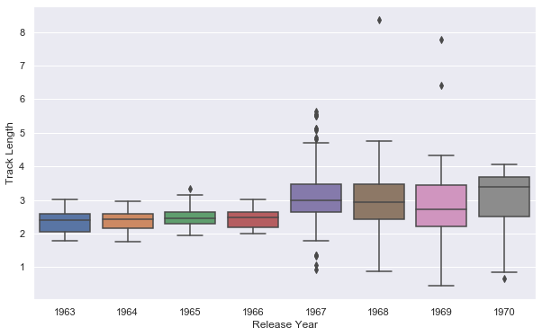

#### Import all packages and authenticate Spotipy credentials
```python
import pandas as pd
import numpy as np

import spotipy
from spotipy.oauth2 import SpotifyClientCredentials
import spotipy.util as util

username = 'drogers771'
scope=''

ccm = SpotifyClientCredentials(client_id=my_client_id,
                               client_secret=my_client_secret)

my_token = util.prompt_for_user_token(username,
                           scope,
                           client_id=my_client_id,
                           client_secret=my_client_secret,
                           redirect_uri='http://localhost:8889')
```

#### Let's pick a popular artist. This time we will look at The Beatles


```python
from spotipy.oauth2 import SpotifyClientCredentials
import sys
import spotipy

sp = spotipy.Spotify(client_credentials_manager=ccm)

def get_artist(name):
    results = sp.search(q='artist:' + name, type='artist',market='US')
    items = results['artists']['items']
    return items[0]

artist = get_artist('The Beatles')
```

#### Grab all the albums for our artist above


```python
albums = []
results = sp.artist_albums(artist['id'], album_type='album')
albums.extend(results['items'])
while results['next']:
    results = sp.next(results)
    albums.extend(results['items'])
    
unique = []
album_id = []


for album in albums:
    name = album['name'].lower()
    id_name = album['id']
    if name not in unique:
        unique.append(name)
        album_id.append(id_name)
 
print('Total albums on Spotify:', len(unique))

```

    Total albums on Spotify: 23
    

#### Grab all the songs on each of their albums


```python
tracks = []
ids = []
Artist=[]
Album=[]
Track=[]
Track_Length=[]

for i in album_id:
    results = sp.album_tracks(album_id=i)
    tracks.extend(results['items'])
while results['next']:
    results = sp.next(results)
    tracks.extend(results['items'])
for track in tracks:
    ids.append(track['id'])
    Track.append(track['name'])
    Artist.append(track['artists'][0]['name'])
    Track_Length.append(track['duration_ms']/60000)   
    
df_tracks = pd.DataFrame({'Artist':Artist,
                        'Track':Track,
                        'Track Length':Track_Length,
                        'Track ID':ids})
print(df_tracks.shape)
```

    (534, 4)
    

#### Go back and grab some features such as when the album was released and tracks' popularity


```python
temp=[]
Artist=[]
Album_ID=[]
Album=[]
Album_Release=[]
Track=[]
Track_ID=[]
Popularity=[]

for row in df_tracks['Track ID']:
    results = sp.track(track_id=row)
    temp.append(results)
for i in temp:
    Artist.append(i['artists'][0]['name'])
    Album.append(i['album']['name'])
    Album_ID.append(i['album']['id'])
    Album_Release.append(i['album']['release_date'])
    Track.append(i['name'])
    Track_ID.append(i['id'])
    Popularity.append(i['popularity'])
df_albums = pd.DataFrame({'Artist':Artist,
                          'Album':Album,
                          'Album ID':Album_ID,
                          'Album Release':Album_Release,
                           #'Track':Track,
                          'Track ID':Track_ID,
                          'Popularity':Popularity})
print(df_albums.shape)
```

    retrying ...1secs
    retrying ...1secs
    (534, 6)
    

#### Grab features of each song like Energy, Loudness, etc.


```python
audio = []
Danceability = []
Energy = []
Key = []
Loudness = []
Speechiness = []
Acousticness = []
Instrumentalness = []
Liveness = []
Valence = []
Tempo = []
track_id = []

for i in ids:
    results = sp.audio_features(i)
    audio.extend(results) 
for i,j in enumerate(audio):
    track_id.append(j['id'])
    Danceability.append(j['danceability'])
    Energy.append(j['energy'])
    Key.append(j['key'])
    Loudness.append(j['loudness'])
    Speechiness.append(j['speechiness'])
    Acousticness.append(j['acousticness'])
    Instrumentalness.append(j['instrumentalness'])
    Liveness.append(j['liveness'])
    Valence.append(j['valence'])
    Tempo.append(j['tempo'])
    
df_audio = pd.DataFrame({'Track ID': track_id,
                        'Danceability':Danceability,
                        'Energy':Energy,
                        'Key':Key,
                        'Loudness':Loudness,
                        'Speechiness':Speechiness,
                        'Acousticness':Acousticness,
                        'Instrumentalness':Instrumentalness,
                        'Liveness':Liveness,
                        'Valence':Valence,
                        'Tempo':Tempo})
print(df_audio.shape)
```

    retrying ...1secs
    retrying ...1secs
    retrying ...1secs
    retrying ...1secs
    (534, 11)
    

#### Merge the previous two dataframes


```python
df = df_tracks.merge(df_audio,on='Track ID')
df = df.merge(df_albums, on='Track ID')
```

#### Show the first five entries of the dataset


```python
df
```


<div>
<style scoped>
    .dataframe tbody tr th:only-of-type {
        vertical-align: middle;
    }

    .dataframe tbody tr th {
        vertical-align: top;
    }

    .dataframe thead th {
        text-align: right;
    }
</style>
<table border="1" class="dataframe">
  <thead>
    <tr style="text-align: right;">
      <th></th>
      <th>Artist_x</th>
      <th>Track</th>
      <th>Track Length</th>
      <th>Track ID</th>
      <th>Danceability</th>
      <th>Energy</th>
      <th>Key</th>
      <th>Loudness</th>
      <th>Speechiness</th>
      <th>Acousticness</th>
      <th>Instrumentalness</th>
      <th>Liveness</th>
      <th>Valence</th>
      <th>Tempo</th>
      <th>Artist_y</th>
      <th>Album</th>
      <th>Album ID</th>
      <th>Album Release</th>
      <th>Popularity</th>
    </tr>
  </thead>
  <tbody>
    <tr>
      <td>0</td>
      <td>The Beatles</td>
      <td>Come Together - 2019 Mix</td>
      <td>4.336667</td>
      <td>6lSxM9BKcEZBSDKl2VODsF</td>
      <td>0.536</td>
      <td>0.360</td>
      <td>9</td>
      <td>-10.973</td>
      <td>0.0408</td>
      <td>0.0823</td>
      <td>0.167000</td>
      <td>0.0996</td>
      <td>0.147</td>
      <td>164.891</td>
      <td>The Beatles</td>
      <td>Abbey Road (Super Deluxe Edition)</td>
      <td>5iT3F2EhjVQVrO4PKhsP8c</td>
      <td>2019-09-27</td>
      <td>57</td>
    </tr>
    <tr>
      <td>1</td>
      <td>The Beatles</td>
      <td>Something - 2019 Mix</td>
      <td>3.037100</td>
      <td>3S6N0Wbem9KV3DBcYNfXuv</td>
      <td>0.416</td>
      <td>0.385</td>
      <td>0</td>
      <td>-9.388</td>
      <td>0.0279</td>
      <td>0.0958</td>
      <td>0.000005</td>
      <td>0.2280</td>
      <td>0.458</td>
      <td>133.298</td>
      <td>The Beatles</td>
      <td>Abbey Road (Super Deluxe Edition)</td>
      <td>5iT3F2EhjVQVrO4PKhsP8c</td>
      <td>2019-09-27</td>
      <td>56</td>
    </tr>
    <tr>
      <td>2</td>
      <td>The Beatles</td>
      <td>Maxwell's Silver Hammer - 2019 Mix</td>
      <td>3.466217</td>
      <td>0fnY9xlLJCgtBUBX9rNzDJ</td>
      <td>0.816</td>
      <td>0.386</td>
      <td>2</td>
      <td>-9.443</td>
      <td>0.0382</td>
      <td>0.4970</td>
      <td>0.000093</td>
      <td>0.3090</td>
      <td>0.708</td>
      <td>131.099</td>
      <td>The Beatles</td>
      <td>Abbey Road (Super Deluxe Edition)</td>
      <td>5iT3F2EhjVQVrO4PKhsP8c</td>
      <td>2019-09-27</td>
      <td>53</td>
    </tr>
    <tr>
      <td>3</td>
      <td>The Beatles</td>
      <td>Oh! Darling - 2019 Mix</td>
      <td>3.452433</td>
      <td>3UHv8SSIkNUDRBUHJx3Cg6</td>
      <td>0.437</td>
      <td>0.669</td>
      <td>4</td>
      <td>-6.524</td>
      <td>0.0395</td>
      <td>0.0344</td>
      <td>0.003950</td>
      <td>0.3470</td>
      <td>0.514</td>
      <td>173.670</td>
      <td>The Beatles</td>
      <td>Abbey Road (Super Deluxe Edition)</td>
      <td>5iT3F2EhjVQVrO4PKhsP8c</td>
      <td>2019-09-27</td>
      <td>55</td>
    </tr>
    <tr>
      <td>4</td>
      <td>The Beatles</td>
      <td>Octopus's Garden - 2019 Mix</td>
      <td>2.846667</td>
      <td>3e1w0Wm0sH8nUYPArDkBG3</td>
      <td>0.565</td>
      <td>0.645</td>
      <td>1</td>
      <td>-6.194</td>
      <td>0.0332</td>
      <td>0.1130</td>
      <td>0.000625</td>
      <td>0.1240</td>
      <td>0.626</td>
      <td>92.253</td>
      <td>The Beatles</td>
      <td>Abbey Road (Super Deluxe Edition)</td>
      <td>5iT3F2EhjVQVrO4PKhsP8c</td>
      <td>2019-09-27</td>
      <td>53</td>
    </tr>
    <tr>
      <td>...</td>
      <td>...</td>
      <td>...</td>
      <td>...</td>
      <td>...</td>
      <td>...</td>
      <td>...</td>
      <td>...</td>
      <td>...</td>
      <td>...</td>
      <td>...</td>
      <td>...</td>
      <td>...</td>
      <td>...</td>
      <td>...</td>
      <td>...</td>
      <td>...</td>
      <td>...</td>
      <td>...</td>
      <td>...</td>
    </tr>
    <tr>
      <td>529</td>
      <td>The Beatles</td>
      <td>Baby It's You - Remastered 2009</td>
      <td>2.675333</td>
      <td>2VmB1rF9FtfKUmFHDVnq8Q</td>
      <td>0.608</td>
      <td>0.494</td>
      <td>4</td>
      <td>-12.211</td>
      <td>0.0345</td>
      <td>0.7780</td>
      <td>0.000000</td>
      <td>0.0926</td>
      <td>0.879</td>
      <td>112.421</td>
      <td>The Beatles</td>
      <td>Please Please Me (Remastered)</td>
      <td>3KzAvEXcqJKBF97HrXwlgf</td>
      <td>1963-03-22</td>
      <td>58</td>
    </tr>
    <tr>
      <td>530</td>
      <td>The Beatles</td>
      <td>Do You Want To Know A Secret - Remastered 2009</td>
      <td>1.950217</td>
      <td>7Aobt67JnaF7qN8jCCKvHq</td>
      <td>0.673</td>
      <td>0.349</td>
      <td>4</td>
      <td>-12.414</td>
      <td>0.0368</td>
      <td>0.6080</td>
      <td>0.000000</td>
      <td>0.3800</td>
      <td>0.609</td>
      <td>124.451</td>
      <td>The Beatles</td>
      <td>Please Please Me (Remastered)</td>
      <td>3KzAvEXcqJKBF97HrXwlgf</td>
      <td>1963-03-22</td>
      <td>61</td>
    </tr>
    <tr>
      <td>531</td>
      <td>The Beatles</td>
      <td>A Taste Of Honey - Remastered 2009</td>
      <td>2.058000</td>
      <td>7fh53ta3vAOGJMQ4i5tCHe</td>
      <td>0.420</td>
      <td>0.372</td>
      <td>1</td>
      <td>-11.416</td>
      <td>0.0327</td>
      <td>0.6980</td>
      <td>0.000000</td>
      <td>0.1040</td>
      <td>0.412</td>
      <td>101.408</td>
      <td>The Beatles</td>
      <td>Please Please Me (Remastered)</td>
      <td>3KzAvEXcqJKBF97HrXwlgf</td>
      <td>1963-03-22</td>
      <td>47</td>
    </tr>
    <tr>
      <td>532</td>
      <td>The Beatles</td>
      <td>There's A Place - Remastered 2009</td>
      <td>1.841550</td>
      <td>4dessGxnKXmTbHPhVgqODq</td>
      <td>0.455</td>
      <td>0.582</td>
      <td>4</td>
      <td>-10.009</td>
      <td>0.0292</td>
      <td>0.6290</td>
      <td>0.000004</td>
      <td>0.1720</td>
      <td>0.927</td>
      <td>140.928</td>
      <td>The Beatles</td>
      <td>Please Please Me (Remastered)</td>
      <td>3KzAvEXcqJKBF97HrXwlgf</td>
      <td>1963-03-22</td>
      <td>47</td>
    </tr>
    <tr>
      <td>533</td>
      <td>The Beatles</td>
      <td>Twist And Shout - Remastered 2009</td>
      <td>2.587100</td>
      <td>5ZBeML7Lf3FMEVviTyvi8l</td>
      <td>0.482</td>
      <td>0.849</td>
      <td>2</td>
      <td>-9.198</td>
      <td>0.0452</td>
      <td>0.6410</td>
      <td>0.000008</td>
      <td>0.0414</td>
      <td>0.937</td>
      <td>124.631</td>
      <td>The Beatles</td>
      <td>Please Please Me (Remastered)</td>
      <td>3KzAvEXcqJKBF97HrXwlgf</td>
      <td>1963-03-22</td>
      <td>73</td>
    </tr>
  </tbody>
</table>
<p>534 rows × 19 columns</p>
</div>


#### Create new feature for year the album was released.


```python
df['Release Year'] = df['Album Release'].str.split('-').str[0]
```

#### Attempting to get all tracknames to be written the same way. Some have (Live) or '- Remastered 2009'. Additionally, some tracks were just entered incorrectly in Spotify.


```python
df['Track_New'] = df['Track'].str.replace(' \[| \(', '-').str.split('-',expand = True)[0].str.rstrip().str.lower()
df.groupby('Track_New').mean()['Track Length']

pd.set_option('display.max_rows', df.shape[0]+1)
df['Track_New'].value_counts()

df['Track_New'].describe()
```


    count                                       534
    unique                                      275
    top       sgt. pepper's lonely hearts club band
    freq                                         11
    Name: Track_New, dtype: object


#### It looks like there are a lot of duplicated songs. There may be some rereleases or greatest hits in the data that's causing songs to appear more than once.


```python
import matplotlib.pyplot as plt
import seaborn as sns
sns.set(style="darkgrid")
```


```python
plt.figure(figsize=(10,6))
a = sns.boxplot(x=df['Release Year'], y=df['Track Length'])
a.set_prop_cycle(color=['blue'])
```


#### Track length dramatically changes after 1966! It looks like a few albums were release after 1970. Let's see if the duplications go away when I remove thos albums.


```python
df = df[df['Release Year']<='1970']
df['Track'].describe()
```


    count                                            274
    unique                                           244
    top       She's Leaving Home - Take 1 / Instrumental
    freq                                               2
    Name: Track, dtype: object


```python
plt.figure(figsize=(10,6))
a=sns.boxplot(x=df['Release Year'], y=df['Track Length'])
a.set_prop_cycle(color=['red'])
```





```python
a=sns.distplot(df['Popularity'],bins=60)
a.set_prop_cycle(color=['red'])
```


#### Now, I want to take a look at how the features are correlated. It doesn't look like any of our features are highly correlated with our targe ' Popularity'


```python
corr_df = df.corr()
plt.figure(figsize=(10,6))
a=sns.heatmap(corr_df, cmap="Blues")
a.set_prop_cycle(color=['red'])
```


```python
sns.pairplot(df)
```


    <seaborn.axisgrid.PairGrid at 0x1b456a84648>


```python
df['Release Year'] = df['Release Year'].astype(str)
```

    C:\Users\roger\Anaconda3\lib\site-packages\ipykernel_launcher.py:1: SettingWithCopyWarning: 
    A value is trying to be set on a copy of a slice from a DataFrame.
    Try using .loc[row_indexer,col_indexer] = value instead
    
    See the caveats in the documentation: http://pandas.pydata.org/pandas-docs/stable/user_guide/indexing.html#returning-a-view-versus-a-copy
      """Entry point for launching an IPython kernel.
    

### Modeling 
#### Importing packages that I will need


```python
from prettytable import PrettyTable
# Sklearn model selection
from sklearn.model_selection import train_test_split
from sklearn.model_selection import RandomizedSearchCV
# Sklearn metrics
from sklearn.metrics import mean_squared_error, mean_absolute_error, mean_squared_log_error
# Sklearn models
from sklearn.linear_model import Lasso, ElasticNet, Ridge, SGDRegressor
from sklearn.svm import SVR, NuSVR
from sklearn.ensemble import BaggingRegressor, RandomForestRegressor
from sklearn.neighbors import KNeighborsClassifier
from sklearn.cluster import KMeans

from sklearn.ensemble import RandomForestClassifier
from sklearn.ensemble import GradientBoostingClassifier

from sklearn.linear_model import LinearRegression

import random

%matplotlib inline

# Make results reproducible
random.seed(100)
```


```python
df.columns
```


    Index(['Artist_x', 'Track', 'Track Length', 'Track ID', 'Danceability',
           'Energy', 'Key', 'Loudness', 'Speechiness', 'Acousticness',
           'Instrumentalness', 'Liveness', 'Valence', 'Tempo', 'Artist_y', 'Album',
           'Album ID', 'Album Release', 'Popularity', 'Release Year', 'Track_New'],
          dtype='object')


```python
x_columns = ['Track Length', 'Danceability','Energy', 'Key', 'Loudness', 'Speechiness', 'Acousticness',
       'Instrumentalness', 'Liveness', 'Valence', 'Tempo','Release Year']
y_column = df['Popularity']
```

#### Splitting data into training and testing sets


```python
X_train, X_test, y_train, y_test = train_test_split(df[x_columns], 
                                                    y_column, 
                                                    test_size=0.2, 
                                                    random_state=42)
```

#### Running the data through 9 different models to see which model predicts my test data


```python
table = PrettyTable()
table.field_names = ["Model", "Mean Squared Error", "R² score"]

models = [
    Lasso(alpha=0.1),
    ElasticNet(random_state=0),
    Ridge(alpha=.5),
    SVR(gamma='auto', kernel='linear'),
    SVR(gamma='auto', kernel='rbf'),
    BaggingRegressor(),
    BaggingRegressor(KNeighborsClassifier(), max_samples=0.5, max_features=0.5),
    NuSVR(gamma='auto'),
    RandomForestRegressor( random_state=0, n_estimators=300)
]

for model in models:
    model.fit(X_train, y_train) 
    y_res = model.predict(X_test)

    mse = mean_squared_error(y_test, y_res)
    score = model.score(X_test, y_test)    

    table.add_row([type(model).__name__, format(mse, '.2f'), format(score, '.2f')])

print(table)
```

    +-----------------------+--------------------+----------+
    |         Model         | Mean Squared Error | R² score |
    +-----------------------+--------------------+----------+
    |         Lasso         |       162.69       |  -0.06   |
    |       ElasticNet      |       174.85       |  -0.14   |
    |         Ridge         |       163.65       |  -0.07   |
    |          SVR          |       178.25       |  -0.16   |
    |          SVR          |       167.16       |  -0.09   |
    |    BaggingRegressor   |       156.23       |  -0.02   |
    |    BaggingRegressor   |       260.56       |  -0.70   |
    |         NuSVR         |       178.73       |  -0.16   |
    | RandomForestRegressor |       117.07       |   0.24   |
    +-----------------------+--------------------+----------+
    

#### The random forest model has the lowest MSE and highest R². Below I am going to see if I can improve on that model


```python
# Table setup
table = PrettyTable()
table.field_names = ["Model", "Dataset", "MSE", "MAE", 'RMSLE', "R² score"]
# Model training
model = RandomForestRegressor(bootstrap=True, criterion='mse', max_depth=None,
           max_features='auto', max_leaf_nodes=None,
           min_impurity_decrease=0.0, min_impurity_split=None,
           min_samples_leaf=1, min_samples_split=4,
           min_weight_fraction_leaf=0.0, n_estimators=200, n_jobs=None,
           oob_score=False, random_state=None, verbose=0, warm_start=False)
model.fit(X_train, y_train) 

def evaluate(x, y, dataset):
    pred = model.predict(x)

    mse = mean_squared_error(y, pred)
    mae = mean_absolute_error(y, pred)
    score = model.score(x, y)    
    rmsle = np.sqrt(mean_squared_log_error(y, pred))

    table.add_row([type(model).__name__, dataset, format(mse, '.2f'), format(mae, '.2f'), format(rmsle, '.2f'), format(score, '.2f')])
    

evaluate(X_train, y_train, 'training')
evaluate(X_test, y_test, 'validation')

print(table)
```

    +-----------------------+------------+--------+------+-------+----------+
    |         Model         |  Dataset   |  MSE   | MAE  | RMSLE | R² score |
    +-----------------------+------------+--------+------+-------+----------+
    | RandomForestRegressor |  training  | 14.67  | 2.90 |  0.09 |   0.92   |
    | RandomForestRegressor | validation | 119.15 | 8.50 |  0.21 |   0.22   |
    +-----------------------+------------+--------+------+-------+----------+
    

### Feature importance


```python
importances = model.feature_importances_
std = np.std([tree.feature_importances_ for tree in model.estimators_], axis=0)
indices = np.argsort(importances)[::-1]
```

#### Print the feature ranking


```python
print("Feature ranking:")

for f in range(X_test.shape[1]):
    print("%d. feature %s (%f)" % (f + 1, x_columns[indices[f]], importances[indices[f]]))
```

    Feature ranking:
    1. feature Release Year (0.238756)
    2. feature Speechiness (0.220008)
    3. feature Loudness (0.097321)
    4. feature Valence (0.069859)
    5. feature Energy (0.058355)
    6. feature Tempo (0.057656)
    7. feature Acousticness (0.057093)
    8. feature Danceability (0.050881)
    9. feature Liveness (0.049203)
    10. feature Track Length (0.038286)
    11. feature Instrumentalness (0.033633)
    12. feature Key (0.028948)
    

#### Plot the feature importances of the forest


```python
plt.figure(figsize=(14,5))
plt.title("Feature importances")
plt.bar(range(X_test.shape[1]), importances[indices], color="cornflowerblue", yerr=std[indices], align="center")
plt.xticks(range(X_test.shape[1]), [x_columns[i] for i in indices],rotation=45)
plt.xlim([-1, X_test.shape[1]])
plt.show()
```


```python

```
