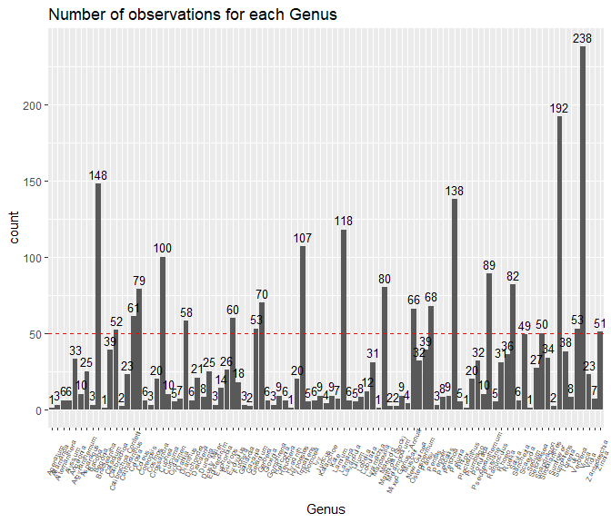
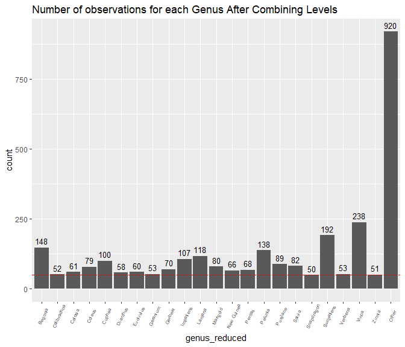
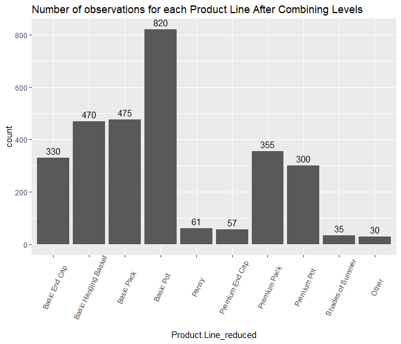
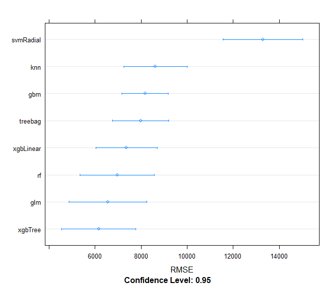
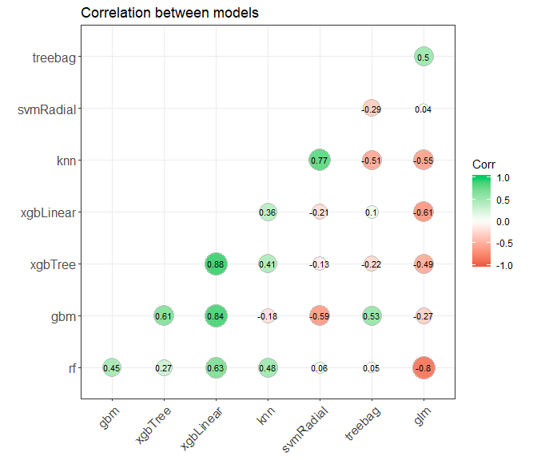
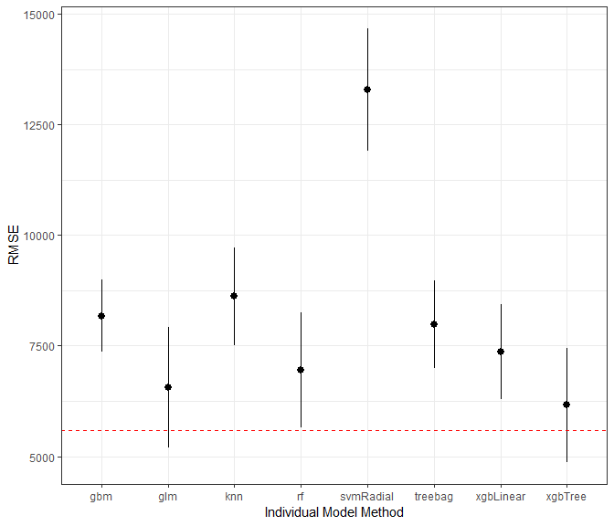

#### Load Data and look at data structure
```r
setwd("C:\\Users\\user\\Documents\\Datalore Projects\\Sales Plan\\")
options(scipen = 999)
sales_raw <- read.csv("salesplandata.csv",stringsAsFactors=FALSE,fileEncoding="UTF-8-BOM")
kable(str(sales_raw))
```

```
## 'data.frame':	4090 obs. of  29 variables:
##  $ Production.Year          : int  2019 2019 2019 2019 2017 2019 2018 2018 2017 2019 ...
##  $ Production.Month         : int  2 2 2 2 2 7 3 2 3 3 ...
##  $ Product.Line             : chr  "Premium Pot" "Premium End Cap" "Premium Pot" "Basic End Cap" ...
##  $ Genus                    : chr  "Ipomoea" "Begonia" "Ipomoea" "Sunpatiens" ...
##  $ SalesPlanQty             : int  2500 2000 2500 2000 2000 1500 0 0 500 2000 ...
##  $ LYSalesPlanQty           : int  2500 2500 2500 2500 2500 2500 2500 2500 2500 2500 ...
##  $ L2YSalesPlanQty          : int  2500 2000 2500 2000 2500 1500 0 0 0 2000 ...
##  $ CustomerComp             : num  NA -0.9556 NA -0.0529 -0.0226 ...
##  $ GenusComp                : num  -0.0487 -0.0563 -0.0487 -0.057 -0.057 ...
##  $ ProductLineComp          : num  -0.0609 -0.0659 -0.0609 -0.0126 -0.0431 ...
##  $ CustomerMarginPerc       : num  0.263 -0.198 0.416 0.35 0.383 ...
##  $ CustomerMarginPercAllYear: num  0.2629 0.0953 0.416 0.3263 0.3884 ...
##  $ CustomerST               : num  NA NA NA 0.843 1.187 ...
##  $ CustomerSTAllYear        : num  NA NA NA 0.915 0.911 ...
##  $ Customer.POS.Qty         : int  8 20 7 1832 1111 2273 19 416 137 191 ...
##  $ Shipped.Qty              : int  0 0 0 2172 936 1638 324 1440 1092 594 ...
##  $ Loss..                   : num  NA -1 NA -0.00429 -0.0017 ...
##  $ PriorMonthPOS            : int  0 162 0 1516 3004 4544 -7 154 -25 0 ...
##  $ Prior2MonthPOS           : int  0 0 0 0 0 5432 -6 0 -7 0 ...
##  $ Prior3MonthPOS           : int  0 0 0 0 0 2402 0 0 0 0 ...
##  $ PostMonthPOS             : int  0 0 0 2092 1269 484 734 2838 1512 48 ...
##  $ Post2MonthPOS            : int  0 0 0 3220 2484 31 2518 8249 2256 1 ...
##  $ Post3MonthPOS            : int  0 0 0 3580 2095 -2 1618 18134 3719 -3 ...
##  $ PriorMonthShipped        : int  0 0 0 984 1644 2322 0 420 0 0 ...
##  $ Prior2MonthShipped       : int  0 0 0 0 0 5742 0 0 0 0 ...
##  $ Prior3MonthShipped       : int  0 0 0 0 0 5310 0 0 0 0 ...
##  $ PostMonthShipped         : int  0 0 0 3336 2448 0 1860 4200 1476 0 ...
##  $ Post2MonthShipped        : int  0 0 0 3036 2904 0 2964 18190 3576 0 ...
##  $ Post3MonthShipped        : int  0 0 0 3708 2448 0 708 18950 3456 0 ...
```

<table>
<tbody>
  <tr>

  </tr>
</tbody>
</table>
#### Create Index To Split Data Into Testing and Training Sets Later

```r
sales_raw$ID <- seq.int(nrow(sales_raw))
```

#### Remove unneeded columns

```r
sales_data <- sales_raw%>%
  filter(SalesPlanQty>0)
```
#### Check null values and exclude from dataset

```r
kable(colSums(sapply(sales_data,is.na)),caption = 'Number of Nulls in each column')%>%
  kable_styling(bootstrap_options = c("striped", "hover"), full_width = F)
```

<table class="table table-striped table-hover" style="width: auto !important; margin-left: auto; margin-right: auto;">
<caption>Number of Nulls in each column</caption>
 <thead>
  <tr>
   <th style="text-align:left;">   </th>
   <th style="text-align:right;"> x </th>
  </tr>
 </thead>
<tbody>
  <tr>
   <td style="text-align:left;"> Production.Year </td>
   <td style="text-align:right;"> 0 </td>
  </tr>
  <tr>
   <td style="text-align:left;"> Production.Month </td>
   <td style="text-align:right;"> 0 </td>
  </tr>
  <tr>
   <td style="text-align:left;"> Product.Line </td>
   <td style="text-align:right;"> 0 </td>
  </tr>
  <tr>
   <td style="text-align:left;"> Genus </td>
   <td style="text-align:right;"> 0 </td>
  </tr>
  <tr>
   <td style="text-align:left;"> SalesPlanQty </td>
   <td style="text-align:right;"> 0 </td>
  </tr>
  <tr>
   <td style="text-align:left;"> LYSalesPlanQty </td>
   <td style="text-align:right;"> 0 </td>
  </tr>
  <tr>
   <td style="text-align:left;"> L2YSalesPlanQty </td>
   <td style="text-align:right;"> 0 </td>
  </tr>
  <tr>
   <td style="text-align:left;"> CustomerComp </td>
   <td style="text-align:right;"> 397 </td>
  </tr>
  <tr>
   <td style="text-align:left;"> GenusComp </td>
   <td style="text-align:right;"> 0 </td>
  </tr>
  <tr>
   <td style="text-align:left;"> ProductLineComp </td>
   <td style="text-align:right;"> 0 </td>
  </tr>
  <tr>
   <td style="text-align:left;"> CustomerMarginPerc </td>
   <td style="text-align:right;"> 0 </td>
  </tr>
  <tr>
   <td style="text-align:left;"> CustomerMarginPercAllYear </td>
   <td style="text-align:right;"> 0 </td>
  </tr>
  <tr>
   <td style="text-align:left;"> CustomerST </td>
   <td style="text-align:right;"> 211 </td>
  </tr>
  <tr>
   <td style="text-align:left;"> CustomerSTAllYear </td>
   <td style="text-align:right;"> 74 </td>
  </tr>
  <tr>
   <td style="text-align:left;"> Customer.POS.Qty </td>
   <td style="text-align:right;"> 0 </td>
  </tr>
  <tr>
   <td style="text-align:left;"> Shipped.Qty </td>
   <td style="text-align:right;"> 0 </td>
  </tr>
  <tr>
   <td style="text-align:left;"> Loss.. </td>
   <td style="text-align:right;"> 375 </td>
  </tr>
  <tr>
   <td style="text-align:left;"> PriorMonthPOS </td>
   <td style="text-align:right;"> 0 </td>
  </tr>
  <tr>
   <td style="text-align:left;"> Prior2MonthPOS </td>
   <td style="text-align:right;"> 0 </td>
  </tr>
  <tr>
   <td style="text-align:left;"> Prior3MonthPOS </td>
   <td style="text-align:right;"> 0 </td>
  </tr>
  <tr>
   <td style="text-align:left;"> PostMonthPOS </td>
   <td style="text-align:right;"> 0 </td>
  </tr>
  <tr>
   <td style="text-align:left;"> Post2MonthPOS </td>
   <td style="text-align:right;"> 0 </td>
  </tr>
  <tr>
   <td style="text-align:left;"> Post3MonthPOS </td>
   <td style="text-align:right;"> 0 </td>
  </tr>
  <tr>
   <td style="text-align:left;"> PriorMonthShipped </td>
   <td style="text-align:right;"> 0 </td>
  </tr>
  <tr>
   <td style="text-align:left;"> Prior2MonthShipped </td>
   <td style="text-align:right;"> 0 </td>
  </tr>
  <tr>
   <td style="text-align:left;"> Prior3MonthShipped </td>
   <td style="text-align:right;"> 0 </td>
  </tr>
  <tr>
   <td style="text-align:left;"> PostMonthShipped </td>
   <td style="text-align:right;"> 0 </td>
  </tr>
  <tr>
   <td style="text-align:left;"> Post2MonthShipped </td>
   <td style="text-align:right;"> 0 </td>
  </tr>
  <tr>
   <td style="text-align:left;"> Post3MonthShipped </td>
   <td style="text-align:right;"> 0 </td>
  </tr>
  <tr>
   <td style="text-align:left;"> ID </td>
   <td style="text-align:right;"> 0 </td>
  </tr>
</tbody>
</table>

```r
sales_data <- na.exclude(sales_data)
```

#### Look at the number of levels within each variable. Change variables to correct data type and 

```r
kable(rapply(sales_data,function(x)length(unique(x))),caption = 'Number of unique labels in each column.')%>%
  kable_styling(bootstrap_options = c("striped", "hover"), full_width = F)
```

<table class="table table-striped table-hover" style="width: auto !important; margin-left: auto; margin-right: auto;">
<caption>Number of unique labels in each column.</caption>
 <thead>
  <tr>
   <th style="text-align:left;">   </th>
   <th style="text-align:right;"> x </th>
  </tr>
 </thead>
<tbody>
  <tr>
   <td style="text-align:left;"> Production.Year </td>
   <td style="text-align:right;"> 3 </td>
  </tr>
  <tr>
   <td style="text-align:left;"> Production.Month </td>
   <td style="text-align:right;"> 12 </td>
  </tr>
  <tr>
   <td style="text-align:left;"> Product.Line </td>
   <td style="text-align:right;"> 12 </td>
  </tr>
  <tr>
   <td style="text-align:left;"> Genus </td>
   <td style="text-align:right;"> 95 </td>
  </tr>
  <tr>
   <td style="text-align:left;"> SalesPlanQty </td>
   <td style="text-align:right;"> 179 </td>
  </tr>
  <tr>
   <td style="text-align:left;"> LYSalesPlanQty </td>
   <td style="text-align:right;"> 119 </td>
  </tr>
  <tr>
   <td style="text-align:left;"> L2YSalesPlanQty </td>
   <td style="text-align:right;"> 121 </td>
  </tr>
  <tr>
   <td style="text-align:left;"> CustomerComp </td>
   <td style="text-align:right;"> 1108 </td>
  </tr>
  <tr>
   <td style="text-align:left;"> GenusComp </td>
   <td style="text-align:right;"> 95 </td>
  </tr>
  <tr>
   <td style="text-align:left;"> ProductLineComp </td>
   <td style="text-align:right;"> 12 </td>
  </tr>
  <tr>
   <td style="text-align:left;"> CustomerMarginPerc </td>
   <td style="text-align:right;"> 2919 </td>
  </tr>
  <tr>
   <td style="text-align:left;"> CustomerMarginPercAllYear </td>
   <td style="text-align:right;"> 1108 </td>
  </tr>
  <tr>
   <td style="text-align:left;"> CustomerST </td>
   <td style="text-align:right;"> 2918 </td>
  </tr>
  <tr>
   <td style="text-align:left;"> CustomerSTAllYear </td>
   <td style="text-align:right;"> 1104 </td>
  </tr>
  <tr>
   <td style="text-align:left;"> Customer.POS.Qty </td>
   <td style="text-align:right;"> 2497 </td>
  </tr>
  <tr>
   <td style="text-align:left;"> Shipped.Qty </td>
   <td style="text-align:right;"> 1877 </td>
  </tr>
  <tr>
   <td style="text-align:left;"> Loss.. </td>
   <td style="text-align:right;"> 2566 </td>
  </tr>
  <tr>
   <td style="text-align:left;"> PriorMonthPOS </td>
   <td style="text-align:right;"> 1976 </td>
  </tr>
  <tr>
   <td style="text-align:left;"> Prior2MonthPOS </td>
   <td style="text-align:right;"> 1333 </td>
  </tr>
  <tr>
   <td style="text-align:left;"> Prior3MonthPOS </td>
   <td style="text-align:right;"> 837 </td>
  </tr>
  <tr>
   <td style="text-align:left;"> PostMonthPOS </td>
   <td style="text-align:right;"> 2484 </td>
  </tr>
  <tr>
   <td style="text-align:left;"> Post2MonthPOS </td>
   <td style="text-align:right;"> 2093 </td>
  </tr>
  <tr>
   <td style="text-align:left;"> Post3MonthPOS </td>
   <td style="text-align:right;"> 1621 </td>
  </tr>
  <tr>
   <td style="text-align:left;"> PriorMonthShipped </td>
   <td style="text-align:right;"> 1462 </td>
  </tr>
  <tr>
   <td style="text-align:left;"> Prior2MonthShipped </td>
   <td style="text-align:right;"> 1004 </td>
  </tr>
  <tr>
   <td style="text-align:left;"> Prior3MonthShipped </td>
   <td style="text-align:right;"> 618 </td>
  </tr>
  <tr>
   <td style="text-align:left;"> PostMonthShipped </td>
   <td style="text-align:right;"> 1564 </td>
  </tr>
  <tr>
   <td style="text-align:left;"> Post2MonthShipped </td>
   <td style="text-align:right;"> 1137 </td>
  </tr>
  <tr>
   <td style="text-align:left;"> Post3MonthShipped </td>
   <td style="text-align:right;"> 817 </td>
  </tr>
  <tr>
   <td style="text-align:left;"> ID </td>
   <td style="text-align:right;"> 2933 </td>
  </tr>
</tbody>
</table>

```r
act_factors <- names(sales_data)[which(sapply(sales_data,function(x)length(unique(x))<=96))]
sales_data[act_factors]<- lapply(sales_data[act_factors],factor)
```

### Reduce the number of levels in Genus and Product Line
#### Visualize the number of level in Genus with less than 50 observation and create new variable that reduces the number of Genus levels

```r
sales_data%>%
  dplyr::group_by(Genus)%>%
  dplyr::summarize(count =length(Genus))%>%
  ggplot(., aes(x = Genus, y = count)) + 
  geom_bar(stat = "identity") +
  ggtitle("Number of observations for each Genus")+
  geom_text(aes(label=count), vjust=-.5, size = 3.5)+
  theme(axis.text.x = element_text(angle=65, vjust=0.6, size = 6))+
  geom_abline(slope=0,intercept=50, col= "red" , lty=2)
```

<!-- -->

<table class="table table-striped table-hover" style="width: auto !important; margin-left: auto; margin-right: auto;">
 <thead>
  <tr>
   <th style="text-align:right;"> levels_greater_than_50 </th>
  </tr>
 </thead>
<tbody>
  <tr>
   <td style="text-align:right;"> 21 </td>
  </tr>
</tbody>
</table>

```r
sales_data%>%
  dplyr::group_by(genus_reduced)%>%
  dplyr::summarize(count =length(genus_reduced))%>%
  ggplot(., aes(x = genus_reduced, y = count)) + 
  geom_bar(stat = "identity") +
  ggtitle("Number of observations for each Genus After Combining Levels")+
  geom_text(aes(label=count), vjust=-.5, size = 3.5)+
  theme(axis.text.x = element_text(angle=65, vjust=0.6, size = 6))+
  geom_abline(slope=0,intercept=50, col= "red" , lty=2)
```

<!-- -->
#### Visualize the number of levels in Product Line and create new variable that reduces the number of levels

```r
sales_data%>%
  dplyr::group_by(Product.Line)%>%
  dplyr::summarize(count =length(Product.Line))%>%
  ggplot(., aes(x = Product.Line, y = count)) + 
  geom_bar(stat = "identity") +
  ggtitle("Number of observations for each Product Line")+
  geom_text(aes(label=count), vjust=-.5)+
  theme(axis.text.x = element_text(angle=65, vjust=0.6))
```

<!-- -->

```r
sales_data$Product.Line_reduced <- fct_lump(sales_data$Product.Line, 9)
```

```r
sales_data%>%
  dplyr::group_by(Product.Line_reduced)%>%
  dplyr::summarize(count =length(Product.Line_reduced))%>%
  ggplot(., aes(x = Product.Line_reduced, y = count)) + 
  geom_bar(stat = "identity") +
  ggtitle("Number of observations for each Product Line After Combining Levels")+
  geom_text(aes(label=count), vjust=-.5)+
  theme(axis.text.x = element_text(angle=65, vjust=0.6))
```

<!-- -->

#### Drop redundant variables

```r
sales_data<- sales_data%>%
  select(-c('Genus','GenusComp','ProductLineComp','Product.Line'))
```

### Modeling
#### Dummy all factor variables and create a test and training set 

```r
factor_vars <- names(sales_data)[which(sapply(sales_data,is.factor))]
dummies <- caret::dummyVars(~.,sales_data[factor_vars])
hot_coded <- stats::predict(dummies,sales_data[factor_vars])

numeric_vars <- names(sales_data)[which(sapply(sales_data,is.numeric))]
num_df <- sales_data[numeric_vars]
sales_data_onehot <- cbind(num_df,hot_coded)

trainSet <- sales_data_onehot[ which(sales_data_onehot[['Production.Year.2019']]=='0'),]
testSet <- sales_data_onehot[ which(sales_data_onehot[['Production.Year.2019']]=='1'),]
```

#### Create data frame for adding predictions based on the test data later

```r
preds <- data.frame(index = testSet[['ID']],
                    obs = testSet[['SalesPlanQty']])
```

#### Drop Year variables so that we don't get any errors

```r
trainSet <- trainSet%>%
  select(-c(Production.Year.2017,Production.Year.2018,Production.Year.2019,ID))

testSet <- testSet%>%
  select(-c(Production.Year.2017,Production.Year.2018,Production.Year.2019,ID))
```
### Creating 8 different ML algorithm to train our training data on

```r
TARGET.VAR <- "SalesPlanQty"
candidate.features <- setdiff(names(trainSet),c(TARGET.VAR))

control <- trainControl(method="cv", 
                        number=5,
                        allowParallel = TRUE,
                        savePredictions = 'final',
                        index=createFolds(y = trainSet$SalesPlanQty, 5))

algorithmList <- c('xgbTree','gbm','treebag','rf','xgbLinear', 'glm', 'knn', 'svmRadial')
set.seed(123)
output <- capture.output(
  models <- caretList(trainSet[,candidate.features],
                    trainSet[,TARGET.VAR], 
                    trControl=control, 
                    methodList=algorithmList)
)
results <- resamples(models)
summary(results)
```

```
## 
## Call:
## summary.resamples(object = results)
## 
## Models: xgbTree, gbm, treebag, rf, xgbLinear, glm, knn, svmRadial 
## Number of resamples: 5 
## 
## MAE 
##               Min.  1st Qu.   Median     Mean  3rd Qu.     Max. NA's
## xgbTree   2637.428 2721.985 2726.128 2776.790 2743.828 3054.581    0
## gbm       3032.203 3043.684 3111.276 3199.624 3210.856 3600.104    0
## treebag   3099.639 3119.745 3176.998 3179.753 3227.054 3275.329    0
## rf        2437.218 2446.596 2661.226 2637.262 2819.315 2821.954    0
## xgbLinear 2644.383 2696.732 2748.980 2813.607 2882.822 3095.119    0
## glm       3037.855 3081.852 3097.342 3169.864 3118.863 3513.408    0
## knn       3127.012 3158.533 3296.377 3266.376 3332.952 3417.007    0
## svmRadial 3977.914 4176.274 4359.668 5173.783 4613.576 8741.483    0
## 
## RMSE 
##                Min.   1st Qu.    Median      Mean   3rd Qu.      Max. NA's
## xgbTree    5477.191  5554.174  5664.399  6382.935  6277.512  8941.399    0
## gbm        7615.189  7750.458  8211.933  8465.618  8874.726  9875.786    0
## treebag    6584.800  6924.217  7136.529  7723.727  8718.669  9254.422    0
## rf         5377.780  5560.336  6512.267  6954.287  8442.492  8878.560    0
## xgbLinear  5584.139  6058.581  7062.286  7004.103  7742.407  8573.100    0
## glm        5574.834  5839.821  6459.485  6304.812  6621.339  7028.579    0
## knn        7904.087  7920.332  8206.587  8802.588  9591.169 10390.765    0
## svmRadial 11305.672 11875.741 12299.283 14097.678 13773.012 21234.683    0
## 
## Rsquared 
##                Min.   1st Qu.    Median      Mean   3rd Qu.      Max. NA's
## xgbTree   0.8289601 0.9052816 0.9117711 0.8953623 0.9123067 0.9184920    0
## gbm       0.7958108 0.8138516 0.8262172 0.8214738 0.8291789 0.8423105    0
## treebag   0.8197593 0.8269932 0.8547851 0.8491072 0.8631677 0.8808310    0
## rf        0.8353103 0.8355050 0.8795324 0.8772529 0.9150776 0.9208391    0
## xgbLinear 0.8389560 0.8583360 0.8820060 0.8795809 0.9022909 0.9163156    0
## glm       0.8672814 0.8877565 0.9088949 0.8980954 0.9116003 0.9149439    0
## knn       0.7972584 0.8082220 0.8366949 0.8261298 0.8381716 0.8503024    0
## svmRadial 0.5585796 0.6055735 0.6402596 0.6304875 0.6651735 0.6828510    1
```

```r
dotplot(results,metric = 'RMSE')
```

<!-- -->
### Check the correlation between Base Algorithm results

```r
modelcorr <- modelCor(results)
ggcorrplot(modelcorr, hc.order = TRUE, 
           type = "lower", 
           lab = TRUE, 
           lab_size = 3, 
           method="circle", 
           colors = c("tomato2", "white", "springgreen3"), 
           title="Correlation between models", 
           ggtheme=theme_bw)
```

<!-- -->

#### Check out how the models performed on the Test Data Set by adding our predictions to data frame created earlier

```r
preds$pred_xgbtree <- predict.train(object = models$xgbTree, newdata = testSet[,candidate.features])
preds$pred_gbm <- predict.train(object = models$gbm, newdata = testSet[,candidate.features])
preds$pred_treebag <- predict.train(object = models$treebag, newdata = testSet[,candidate.features])
preds$pred_rf <- predict.train(object = models$rf, newdata = testSet[,candidate.features])
preds$pred_xgblin <- predict.train(object =  models$xgbLinear, newdata = testSet[,candidate.features])
preds$pred_glm <- predict.train(object = models$glm, newdata = testSet[,candidate.features])
preds$pred_knn <- predict.train(object = models$knn, newdata = testSet[,candidate.features])
preds$pred_svmRadial <- predict.train(object = models$svmRadial, newdata = testSet[,candidate.features])
```
#### Below are the results of each of the base models on the test dataset. 

```r
test_results <- data.frame(rmse = rapply(preds[,(ncol(preds)-7):ncol(preds)], function(x)RMSE(x,testSet[,TARGET.VAR])))
test_results$rsquared <- rapply(preds[,(ncol(preds)-7):ncol(preds)], function(x)R2(x,testSet[,TARGET.VAR]))
test_results$mae <- rapply(preds[,(ncol(preds)-7):ncol(preds)], function(x)MAE(x,testSet[,TARGET.VAR]))
```

```r
kable(test_results)%>%
  kable_styling(bootstrap_options = c("striped", "hover"), full_width = F)
```

<table class="table table-striped table-hover" style="width: auto !important; margin-left: auto; margin-right: auto;">
 <thead>
  <tr>
   <th style="text-align:left;">   </th>
   <th style="text-align:right;"> rmse </th>
   <th style="text-align:right;"> rsquared </th>
   <th style="text-align:right;"> mae </th>
  </tr>
 </thead>
<tbody>
  <tr>
   <td style="text-align:left;"> pred_xgbtree </td>
   <td style="text-align:right;"> 4072.373 </td>
   <td style="text-align:right;"> 0.9455741 </td>
   <td style="text-align:right;"> 1962.917 </td>
  </tr>
  <tr>
   <td style="text-align:left;"> pred_gbm </td>
   <td style="text-align:right;"> 3986.104 </td>
   <td style="text-align:right;"> 0.9480784 </td>
   <td style="text-align:right;"> 1963.608 </td>
  </tr>
  <tr>
   <td style="text-align:left;"> pred_treebag </td>
   <td style="text-align:right;"> 4265.334 </td>
   <td style="text-align:right;"> 0.9413298 </td>
   <td style="text-align:right;"> 2427.307 </td>
  </tr>
  <tr>
   <td style="text-align:left;"> pred_rf </td>
   <td style="text-align:right;"> 3581.069 </td>
   <td style="text-align:right;"> 0.9596989 </td>
   <td style="text-align:right;"> 1646.036 </td>
  </tr>
  <tr>
   <td style="text-align:left;"> pred_xgblin </td>
   <td style="text-align:right;"> 3935.272 </td>
   <td style="text-align:right;"> 0.9506062 </td>
   <td style="text-align:right;"> 1847.432 </td>
  </tr>
  <tr>
   <td style="text-align:left;"> pred_glm </td>
   <td style="text-align:right;"> 3467.802 </td>
   <td style="text-align:right;"> 0.9611837 </td>
   <td style="text-align:right;"> 2058.049 </td>
  </tr>
  <tr>
   <td style="text-align:left;"> pred_knn </td>
   <td style="text-align:right;"> 5062.641 </td>
   <td style="text-align:right;"> 0.9341298 </td>
   <td style="text-align:right;"> 2228.943 </td>
  </tr>
  <tr>
   <td style="text-align:left;"> pred_svmRadial </td>
   <td style="text-align:right;"> 7056.251 </td>
   <td style="text-align:right;"> 0.8637596 </td>
   <td style="text-align:right;"> 2755.336 </td>
  </tr>
</tbody>
</table>

#### Next I want to create two different ensemble models. First, I create a GLM Ensemble Model.

#### This graph shows how the first ensemble model (noted by the red line) compared with the RMSE's of the individual models. There is a slight improvement over the best individual model.

```r
plot(ensemble_1)
```

<!-- -->
### Next, I use a GLMNET model as a top layer model.

```r
set.seed(222)
ensemble_2 <- caretStack(models, 
                         method = 'glmnet', 
                         metric = 'RMSE', 
                         trControl = my_control)
```

###  Finally, I use the predicted values from each of the models created to see how their performances compare on data that was withheld from the model training.

```r
preds$ensemble_1 <-predict(object = ensemble_1,newdata = testSet[,candidate.features])
preds$ensemble_2 <-predict(object = ensemble_2,newdata = testSet[,candidate.features])

#Below are the results of each of the models on the test dataset. 
test_results <- data.frame(rmse = rapply(preds[,(ncol(preds)-9):ncol(preds)], function(x)RMSE(x,testSet[,TARGET.VAR])))
test_results$rsquared <- rapply(preds[,(ncol(preds)-9):ncol(preds)], function(x)R2(x,testSet[,TARGET.VAR]))
test_results$mae <- rapply(preds[,(ncol(preds)-9):ncol(preds)], function(x)MAE(x,testSet[,TARGET.VAR]))

kable(test_results)%>%
  kable_styling(bootstrap_options = c("striped", "hover"), full_width = F)
```

<table class="table table-striped table-hover" style="width: auto !important; margin-left: auto; margin-right: auto;">
 <thead>
  <tr>
   <th style="text-align:left;">   </th>
   <th style="text-align:right;"> rmse </th>
   <th style="text-align:right;"> rsquared </th>
   <th style="text-align:right;"> mae </th>
  </tr>
 </thead>
<tbody>
  <tr>
   <td style="text-align:left;"> pred_xgbtree </td>
   <td style="text-align:right;"> 4072.373 </td>
   <td style="text-align:right;"> 0.9455741 </td>
   <td style="text-align:right;"> 1962.917 </td>
  </tr>
  <tr>
   <td style="text-align:left;"> pred_gbm </td>
   <td style="text-align:right;"> 3986.104 </td>
   <td style="text-align:right;"> 0.9480784 </td>
   <td style="text-align:right;"> 1963.608 </td>
  </tr>
  <tr>
   <td style="text-align:left;"> pred_treebag </td>
   <td style="text-align:right;"> 4265.334 </td>
   <td style="text-align:right;"> 0.9413298 </td>
   <td style="text-align:right;"> 2427.307 </td>
  </tr>
  <tr>
   <td style="text-align:left;"> pred_rf </td>
   <td style="text-align:right;"> 3581.069 </td>
   <td style="text-align:right;"> 0.9596989 </td>
   <td style="text-align:right;"> 1646.036 </td>
  </tr>
  <tr>
   <td style="text-align:left;"> pred_xgblin </td>
   <td style="text-align:right;"> 3935.272 </td>
   <td style="text-align:right;"> 0.9506062 </td>
   <td style="text-align:right;"> 1847.432 </td>
  </tr>
  <tr>
   <td style="text-align:left;"> pred_glm </td>
   <td style="text-align:right;"> 3467.802 </td>
   <td style="text-align:right;"> 0.9611837 </td>
   <td style="text-align:right;"> 2058.049 </td>
  </tr>
  <tr>
   <td style="text-align:left;"> pred_knn </td>
   <td style="text-align:right;"> 5062.641 </td>
   <td style="text-align:right;"> 0.9341298 </td>
   <td style="text-align:right;"> 2228.943 </td>
  </tr>
  <tr>
   <td style="text-align:left;"> pred_svmRadial </td>
   <td style="text-align:right;"> 7056.251 </td>
   <td style="text-align:right;"> 0.8637596 </td>
   <td style="text-align:right;"> 2755.336 </td>
  </tr>
  <tr>
   <td style="text-align:left;"> ensemble_1 </td>
   <td style="text-align:right;"> 3270.764 </td>
   <td style="text-align:right;"> 0.9675056 </td>
   <td style="text-align:right;"> 1794.355 </td>
  </tr>
  <tr>
   <td style="text-align:left;"> ensemble_2 </td>
   <td style="text-align:right;"> 3220.921 </td>
   <td style="text-align:right;"> 0.9683373 </td>
   <td style="text-align:right;"> 1731.608 </td>
  </tr>
</tbody>
</table>


[Return to my portfolio](https://dustinrogers.github.io/)


