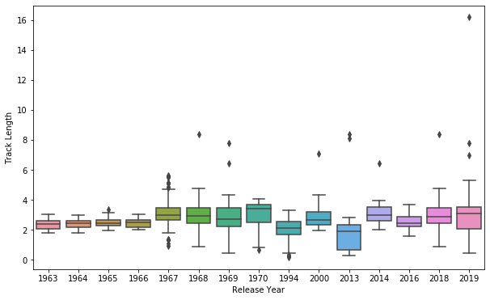
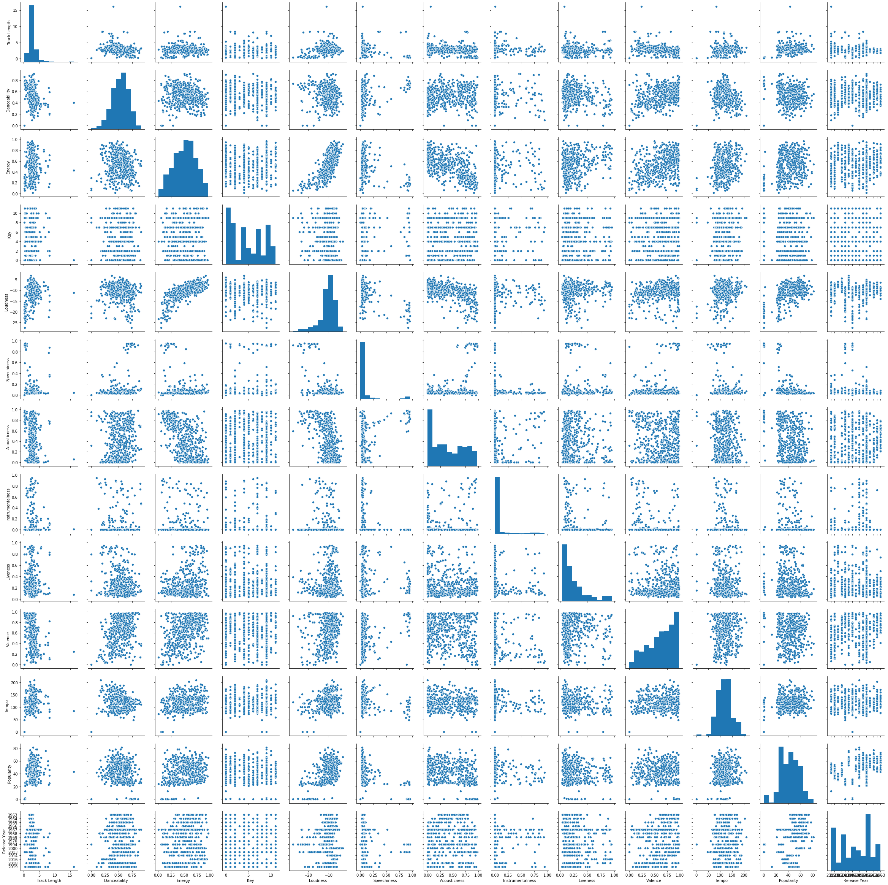

```python
# Import all packages and authenticate Spotipy credentials
import pandas as pd
import numpy as np

import spotipy
from spotipy.oauth2 import SpotifyClientCredentials
import spotipy.util as util

username = 'drogers771'
scope=''

ccm = SpotifyClientCredentials(client_id=my_client_id,
                               client_secret=my_client_secret)

my_token = util.prompt_for_user_token(username,
                           scope,
                           client_id=my_client_id,
                           client_secret=my_client_secret,
                           redirect_uri='http://localhost:8889')
```


```python
# Let's pick a popular artist. This time we will look at The Beatles

from spotipy.oauth2 import SpotifyClientCredentials
import sys
import spotipy

sp = spotipy.Spotify(client_credentials_manager=ccm)

def get_artist(name):
    results = sp.search(q='artist:' + name, type='artist',market='US')
    items = results['artists']['items']
    return items[0]

artist = get_artist('The Beatles')
```


```python
# Grab all the albums for our artist above
albums = []
results = sp.artist_albums(artist['id'], album_type='album')
albums.extend(results['items'])
while results['next']:
    results = sp.next(results)
    albums.extend(results['items'])
    
unique = []
album_id = []


for album in albums:
    name = album['name'].lower()
    id_name = album['id']
    if name not in unique:
        unique.append(name)
        album_id.append(id_name)
 
print('Total albums on Spotify:', len(unique))

```

    Total albums on Spotify: 23
    


```python
# Grab all the songs on each of their albums
tracks = []
ids = []
Artist=[]
Album=[]
Track=[]
Track_Length=[]

for i in album_id:
    results = sp.album_tracks(album_id=i)
    tracks.extend(results['items'])
while results['next']:
    results = sp.next(results)
    tracks.extend(results['items'])
for track in tracks:
    ids.append(track['id'])
    Track.append(track['name'])
    Artist.append(track['artists'][0]['name'])
    Track_Length.append(track['duration_ms']/60000)   
    
df_tracks = pd.DataFrame({'Artist':Artist,
                        'Track':Track,
                        'Track Length':Track_Length,
                        'Track ID':ids})
print(df_tracks.shape)
```

    (534, 4)
    


```python
# Go back and grab some features such as when the album was released and tracks' popularity
temp=[]
Artist=[]
Album_ID=[]
Album=[]
Album_Release=[]
Track=[]
Track_ID=[]
Popularity=[]

for row in df_tracks['Track ID']:
    results = sp.track(track_id=row)
    temp.append(results)
for i in temp:
    Artist.append(i['artists'][0]['name'])
    Album.append(i['album']['name'])
    Album_ID.append(i['album']['id'])
    Album_Release.append(i['album']['release_date'])
    Track.append(i['name'])
    Track_ID.append(i['id'])
    Popularity.append(i['popularity'])
df_albums = pd.DataFrame({'Artist':Artist,
                          'Album':Album,
                          'Album ID':Album_ID,
                          'Album Release':Album_Release,
                           #'Track':Track,
                          'Track ID':Track_ID,
                          'Popularity':Popularity})
print(df_albums.shape)
```

    retrying ...2secs
    retrying ...2secs
    (534, 6)
    


```python
# Grab features of each song like Energy, Loudness, etc.
audio = []
Danceability = []
Energy = []
Key = []
Loudness = []
Speechiness = []
Acousticness = []
Instrumentalness = []
Liveness = []
Valence = []
Tempo = []
track_id = []

for i in ids:
    results = sp.audio_features(i)
    audio.extend(results) 
for i,j in enumerate(audio):
    track_id.append(j['id'])
    Danceability.append(j['danceability'])
    Energy.append(j['energy'])
    Key.append(j['key'])
    Loudness.append(j['loudness'])
    Speechiness.append(j['speechiness'])
    Acousticness.append(j['acousticness'])
    Instrumentalness.append(j['instrumentalness'])
    Liveness.append(j['liveness'])
    Valence.append(j['valence'])
    Tempo.append(j['tempo'])
    
df_audio = pd.DataFrame({'Track ID': track_id,
                        'Danceability':Danceability,
                        'Energy':Energy,
                        'Key':Key,
                        'Loudness':Loudness,
                        'Speechiness':Speechiness,
                        'Acousticness':Acousticness,
                        'Instrumentalness':Instrumentalness,
                        'Liveness':Liveness,
                        'Valence':Valence,
                        'Tempo':Tempo})
print(df_audio.shape)
```

    retrying ...2secs
    retrying ...2secs
    retrying ...2secs
    (534, 11)
    


```python
# Merge the previous two dataframes
df = df_tracks.merge(df_audio,on='Track ID')
df = df.merge(df_albums, on='Track ID')
```


```python
df.head()
```


<div>
<style scoped>
    .dataframe tbody tr th:only-of-type {
        vertical-align: middle;
    }

    .dataframe tbody tr th {
        vertical-align: top;
    }

    .dataframe thead th {
        text-align: right;
    }
</style>
<table border="1" class="dataframe">
  <thead>
    <tr style="text-align: right;">
      <th></th>
      <th>Artist_x</th>
      <th>Track</th>
      <th>Track Length</th>
      <th>Track ID</th>
      <th>Danceability</th>
      <th>Energy</th>
      <th>Key</th>
      <th>Loudness</th>
      <th>Speechiness</th>
      <th>Acousticness</th>
      <th>Instrumentalness</th>
      <th>Liveness</th>
      <th>Valence</th>
      <th>Tempo</th>
      <th>Artist_y</th>
      <th>Album</th>
      <th>Album ID</th>
      <th>Album Release</th>
      <th>Popularity</th>
    </tr>
  </thead>
  <tbody>
    <tr>
      <td>0</td>
      <td>The Beatles</td>
      <td>Come Together - 2019 Mix</td>
      <td>4.336667</td>
      <td>6lSxM9BKcEZBSDKl2VODsF</td>
      <td>0.536</td>
      <td>0.360</td>
      <td>9</td>
      <td>-10.973</td>
      <td>0.0408</td>
      <td>0.0823</td>
      <td>0.167000</td>
      <td>0.0996</td>
      <td>0.147</td>
      <td>164.891</td>
      <td>The Beatles</td>
      <td>Abbey Road (Super Deluxe Edition)</td>
      <td>5iT3F2EhjVQVrO4PKhsP8c</td>
      <td>2019-09-27</td>
      <td>57</td>
    </tr>
    <tr>
      <td>1</td>
      <td>The Beatles</td>
      <td>Something - 2019 Mix</td>
      <td>3.037100</td>
      <td>3S6N0Wbem9KV3DBcYNfXuv</td>
      <td>0.416</td>
      <td>0.385</td>
      <td>0</td>
      <td>-9.388</td>
      <td>0.0279</td>
      <td>0.0958</td>
      <td>0.000005</td>
      <td>0.2280</td>
      <td>0.458</td>
      <td>133.298</td>
      <td>The Beatles</td>
      <td>Abbey Road (Super Deluxe Edition)</td>
      <td>5iT3F2EhjVQVrO4PKhsP8c</td>
      <td>2019-09-27</td>
      <td>56</td>
    </tr>
    <tr>
      <td>2</td>
      <td>The Beatles</td>
      <td>Maxwell's Silver Hammer - 2019 Mix</td>
      <td>3.466217</td>
      <td>0fnY9xlLJCgtBUBX9rNzDJ</td>
      <td>0.816</td>
      <td>0.386</td>
      <td>2</td>
      <td>-9.443</td>
      <td>0.0382</td>
      <td>0.4970</td>
      <td>0.000093</td>
      <td>0.3090</td>
      <td>0.708</td>
      <td>131.099</td>
      <td>The Beatles</td>
      <td>Abbey Road (Super Deluxe Edition)</td>
      <td>5iT3F2EhjVQVrO4PKhsP8c</td>
      <td>2019-09-27</td>
      <td>54</td>
    </tr>
    <tr>
      <td>3</td>
      <td>The Beatles</td>
      <td>Oh! Darling - 2019 Mix</td>
      <td>3.452433</td>
      <td>3UHv8SSIkNUDRBUHJx3Cg6</td>
      <td>0.437</td>
      <td>0.669</td>
      <td>4</td>
      <td>-6.524</td>
      <td>0.0395</td>
      <td>0.0344</td>
      <td>0.003950</td>
      <td>0.3470</td>
      <td>0.514</td>
      <td>173.670</td>
      <td>The Beatles</td>
      <td>Abbey Road (Super Deluxe Edition)</td>
      <td>5iT3F2EhjVQVrO4PKhsP8c</td>
      <td>2019-09-27</td>
      <td>55</td>
    </tr>
    <tr>
      <td>4</td>
      <td>The Beatles</td>
      <td>Octopus's Garden - 2019 Mix</td>
      <td>2.846667</td>
      <td>3e1w0Wm0sH8nUYPArDkBG3</td>
      <td>0.565</td>
      <td>0.645</td>
      <td>1</td>
      <td>-6.194</td>
      <td>0.0332</td>
      <td>0.1130</td>
      <td>0.000625</td>
      <td>0.1240</td>
      <td>0.626</td>
      <td>92.253</td>
      <td>The Beatles</td>
      <td>Abbey Road (Super Deluxe Edition)</td>
      <td>5iT3F2EhjVQVrO4PKhsP8c</td>
      <td>2019-09-27</td>
      <td>53</td>
    </tr>
  </tbody>
</table>
</div>


```python
# Create new feature for year the album was released.
df['Release Year'] = df['Album Release'].str.split('-').str[0]
```


```python
# Attempting to get all trackname to be written the same way. Some have (Live) or '- Live'. Additionally, some tracks were just
# entering incorrectly in Spotify.
df['Track_New'] = df['Track'].str.replace(' \[| \(', '-').str.split('-',expand = True)[0].str.rstrip().str.lower()
df.groupby('Track_New').mean()['Track Length']

pd.set_option('display.max_rows', df.shape[0]+1)
df['Track_New'].value_counts()

df['Track_New'].describe()

```


    count                                       534
    unique                                      275
    top       sgt. pepper's lonely hearts club band
    freq                                         11
    Name: Track_New, dtype: object


```python
import seaborn as sns
import matplotlib.pyplot as plt
%matplotlib inline 
```


```python
plt.figure(figsize=(10,6))
sns.boxplot(x=df['Release Year'], y=df['Track Length'])
```


    <matplotlib.axes._subplots.AxesSubplot at 0x24547948548>





```python
df.describe()
```


<div>
<style scoped>
    .dataframe tbody tr th:only-of-type {
        vertical-align: middle;
    }

    .dataframe tbody tr th {
        vertical-align: top;
    }

    .dataframe thead th {
        text-align: right;
    }
</style>
<table border="1" class="dataframe">
  <thead>
    <tr style="text-align: right;">
      <th></th>
      <th>Track Length</th>
      <th>Danceability</th>
      <th>Energy</th>
      <th>Key</th>
      <th>Loudness</th>
      <th>Speechiness</th>
      <th>Acousticness</th>
      <th>Instrumentalness</th>
      <th>Liveness</th>
      <th>Valence</th>
      <th>Tempo</th>
      <th>Popularity</th>
    </tr>
  </thead>
  <tbody>
    <tr>
      <td>count</td>
      <td>534.000000</td>
      <td>534.000000</td>
      <td>534.000000</td>
      <td>534.000000</td>
      <td>534.000000</td>
      <td>534.000000</td>
      <td>534.000000</td>
      <td>534.000000</td>
      <td>534.000000</td>
      <td>534.000000</td>
      <td>534.000000</td>
      <td>534.000000</td>
    </tr>
    <tr>
      <td>mean</td>
      <td>2.728576</td>
      <td>0.532137</td>
      <td>0.520512</td>
      <td>4.715356</td>
      <td>-10.588633</td>
      <td>0.092637</td>
      <td>0.399164</td>
      <td>0.061139</td>
      <td>0.252632</td>
      <td>0.623287</td>
      <td>120.045039</td>
      <td>42.357678</td>
    </tr>
    <tr>
      <td>std</td>
      <td>1.286471</td>
      <td>0.155006</td>
      <td>0.211224</td>
      <td>3.426181</td>
      <td>3.717782</td>
      <td>0.183298</td>
      <td>0.311577</td>
      <td>0.183754</td>
      <td>0.215810</td>
      <td>0.257750</td>
      <td>29.716396</td>
      <td>15.208043</td>
    </tr>
    <tr>
      <td>min</td>
      <td>0.172667</td>
      <td>0.000000</td>
      <td>0.012400</td>
      <td>0.000000</td>
      <td>-27.456000</td>
      <td>0.000000</td>
      <td>0.000023</td>
      <td>0.000000</td>
      <td>0.037100</td>
      <td>0.000000</td>
      <td>0.000000</td>
      <td>0.000000</td>
    </tr>
    <tr>
      <td>25%</td>
      <td>2.126550</td>
      <td>0.422250</td>
      <td>0.357750</td>
      <td>2.000000</td>
      <td>-11.917500</td>
      <td>0.032625</td>
      <td>0.096100</td>
      <td>0.000000</td>
      <td>0.105000</td>
      <td>0.427500</td>
      <td>96.962000</td>
      <td>30.000000</td>
    </tr>
    <tr>
      <td>50%</td>
      <td>2.601667</td>
      <td>0.541000</td>
      <td>0.531000</td>
      <td>4.000000</td>
      <td>-9.874000</td>
      <td>0.039750</td>
      <td>0.346000</td>
      <td>0.000007</td>
      <td>0.160500</td>
      <td>0.665000</td>
      <td>121.255500</td>
      <td>43.000000</td>
    </tr>
    <tr>
      <td>75%</td>
      <td>3.148721</td>
      <td>0.642500</td>
      <td>0.672500</td>
      <td>7.000000</td>
      <td>-8.333000</td>
      <td>0.055975</td>
      <td>0.679000</td>
      <td>0.001158</td>
      <td>0.324000</td>
      <td>0.840000</td>
      <td>137.203250</td>
      <td>53.000000</td>
    </tr>
    <tr>
      <td>max</td>
      <td>16.174433</td>
      <td>0.915000</td>
      <td>0.969000</td>
      <td>11.000000</td>
      <td>-3.199000</td>
      <td>0.954000</td>
      <td>0.979000</td>
      <td>0.942000</td>
      <td>0.948000</td>
      <td>0.980000</td>
      <td>209.242000</td>
      <td>81.000000</td>
    </tr>
  </tbody>
</table>
</div>


```python
corr_df = df.corr()
plt.figure(figsize=(10,6))
sns.heatmap(corr_df, cmap="Blues")
```


    <matplotlib.axes._subplots.AxesSubplot at 0x2454e248348>


```python
sns.pairplot(df)
```


    <seaborn.axisgrid.PairGrid at 0x245347c0b08>





```python
df['Release Year'] = df['Release Year'].astype(str)
```


```python
from prettytable import PrettyTable
# Sklearn model selection
from sklearn.model_selection import train_test_split
from sklearn.model_selection import RandomizedSearchCV
# Sklearn metrics
from sklearn.metrics import mean_squared_error, mean_absolute_error, mean_squared_log_error
# Sklearn models
from sklearn.linear_model import Lasso, ElasticNet, Ridge, SGDRegressor
from sklearn.svm import SVR, NuSVR
from sklearn.ensemble import BaggingRegressor, RandomForestRegressor
from sklearn.neighbors import KNeighborsClassifier
from sklearn.cluster import KMeans

from sklearn.ensemble import RandomForestClassifier
from sklearn.ensemble import GradientBoostingClassifier

from sklearn.linear_model import LinearRegression

import random

%matplotlib inline

# Make results reproducible
random.seed(100)
```


```python
df.columns
```


    Index(['Artist_x', 'Track', 'Track Length', 'Track ID', 'Danceability',
           'Energy', 'Key', 'Loudness', 'Speechiness', 'Acousticness',
           'Instrumentalness', 'Liveness', 'Valence', 'Tempo', 'Artist_y', 'Album',
           'Album ID', 'Album Release', 'Popularity', 'Release Year', 'Track_New'],
          dtype='object')


```python
x_columns = ['Track Length', 'Danceability','Energy', 'Key', 'Loudness', 'Speechiness', 'Acousticness',
       'Instrumentalness', 'Liveness', 'Valence', 'Tempo','Release Year']
y_column = df['Popularity']
```


```python
X_train, X_test, y_train, y_test = train_test_split(df[x_columns], 
                                                    y_column, 
                                                    test_size=0.2, 
                                                    random_state=42)
```


```python
table = PrettyTable()
table.field_names = ["Model", "Mean Squared Error", "R² score"]

models = [
    Lasso(alpha=0.1),
    ElasticNet(random_state=0),
    Ridge(alpha=.5),
    SVR(gamma='auto', kernel='linear'),
    SVR(gamma='auto', kernel='rbf'),
    BaggingRegressor(),
    BaggingRegressor(KNeighborsClassifier(), max_samples=0.5, max_features=0.5),
    NuSVR(gamma='auto'),
    RandomForestRegressor( random_state=0, n_estimators=300)
]

for model in models:
    model.fit(X_train, y_train) 
    y_res = model.predict(X_test)

    mse = mean_squared_error(y_test, y_res)
    score = model.score(X_test, y_test)    

    table.add_row([type(model).__name__, format(mse, '.2f'), format(score, '.2f')])

print(table)
```

    +-----------------------+--------------------+----------+
    |         Model         | Mean Squared Error | R² score |
    +-----------------------+--------------------+----------+
    |         Lasso         |       168.41       |   0.36   |
    |       ElasticNet      |       186.42       |   0.29   |
    |         Ridge         |       165.64       |   0.37   |
    |          SVR          |       173.50       |   0.34   |
    |          SVR          |       253.98       |   0.04   |
    |    BaggingRegressor   |       89.05        |   0.66   |
    |    BaggingRegressor   |       168.79       |   0.36   |
    |         NuSVR         |       255.73       |   0.03   |
    | RandomForestRegressor |       73.69        |   0.72   |
    +-----------------------+--------------------+----------+
    


```python
# Table setup
table = PrettyTable()
table.field_names = ["Model", "Dataset", "MSE", "MAE", 'RMSLE', "R² score"]
# Model training
model = RandomForestRegressor(bootstrap=True, criterion='mse', max_depth=None,
           max_features='auto', max_leaf_nodes=None,
           min_impurity_decrease=0.0, min_impurity_split=None,
           min_samples_leaf=1, min_samples_split=4,
           min_weight_fraction_leaf=0.0, n_estimators=200, n_jobs=None,
           oob_score=False, random_state=None, verbose=0, warm_start=False)
model.fit(X_train, y_train) 

def evaluate(x, y, dataset):
    pred = model.predict(x)

    mse = mean_squared_error(y, pred)
    mae = mean_absolute_error(y, pred)
    score = model.score(x, y)    
    rmsle = np.sqrt(mean_squared_log_error(y, pred))

    table.add_row([type(model).__name__, dataset, format(mse, '.2f'), format(mae, '.2f'), format(rmsle, '.2f'), format(score, '.2f')])
    

evaluate(X_train, y_train, 'training')
evaluate(X_test, y_test, 'validation')

print(table)
```

    +-----------------------+------------+-------+------+-------+----------+
    |         Model         |  Dataset   |  MSE  | MAE  | RMSLE | R² score |
    +-----------------------+------------+-------+------+-------+----------+
    | RandomForestRegressor |  training  | 11.73 | 2.54 |  0.17 |   0.95   |
    | RandomForestRegressor | validation | 74.07 | 6.38 |  0.44 |   0.72   |
    +-----------------------+------------+-------+------+-------+----------+
    


```python
# Check out feature importance
importances = model.feature_importances_
std = np.std([tree.feature_importances_ for tree in model.estimators_], axis=0)
indices = np.argsort(importances)[::-1]
```


```python
# Print the feature ranking
print("Feature ranking:")

for f in range(X_test.shape[1]):
    print("%d. feature %s (%f)" % (f + 1, x_columns[indices[f]], importances[indices[f]]))
```

    Feature ranking:
    1. feature Release Year (0.242322)
    2. feature Track Length (0.239267)
    3. feature Loudness (0.131128)
    4. feature Speechiness (0.110370)
    5. feature Acousticness (0.055529)
    6. feature Valence (0.045647)
    7. feature Danceability (0.039548)
    8. feature Energy (0.035050)
    9. feature Liveness (0.033997)
    10. feature Tempo (0.027743)
    11. feature Instrumentalness (0.021994)
    12. feature Key (0.017406)
    


```python
# Plot the feature importances of the forest
plt.figure(figsize=(14,5))
plt.title("Feature importances")
plt.bar(range(X_test.shape[1]), importances[indices], color="cornflowerblue", yerr=std[indices], align="center")
plt.xticks(range(X_test.shape[1]), [x_columns[i] for i in indices],rotation=45)
plt.xlim([-1, X_test.shape[1]])
plt.show()
```


```python

```
